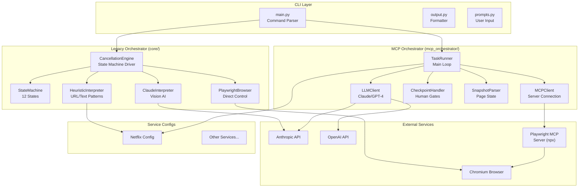
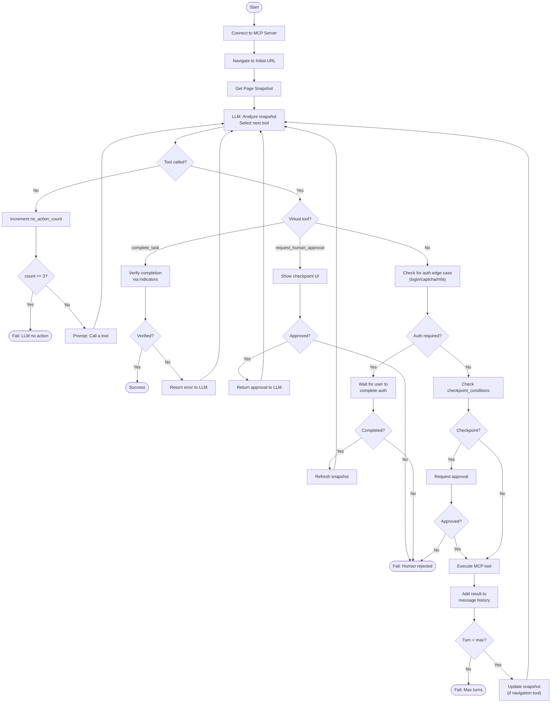
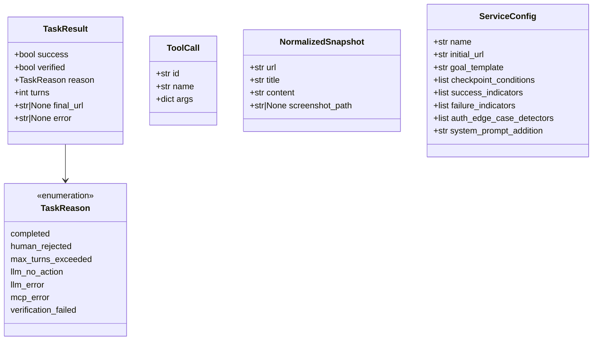
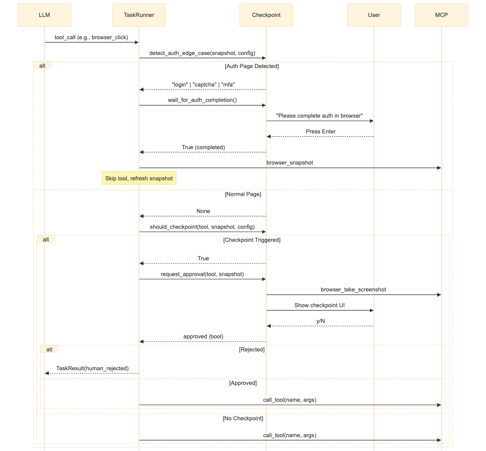
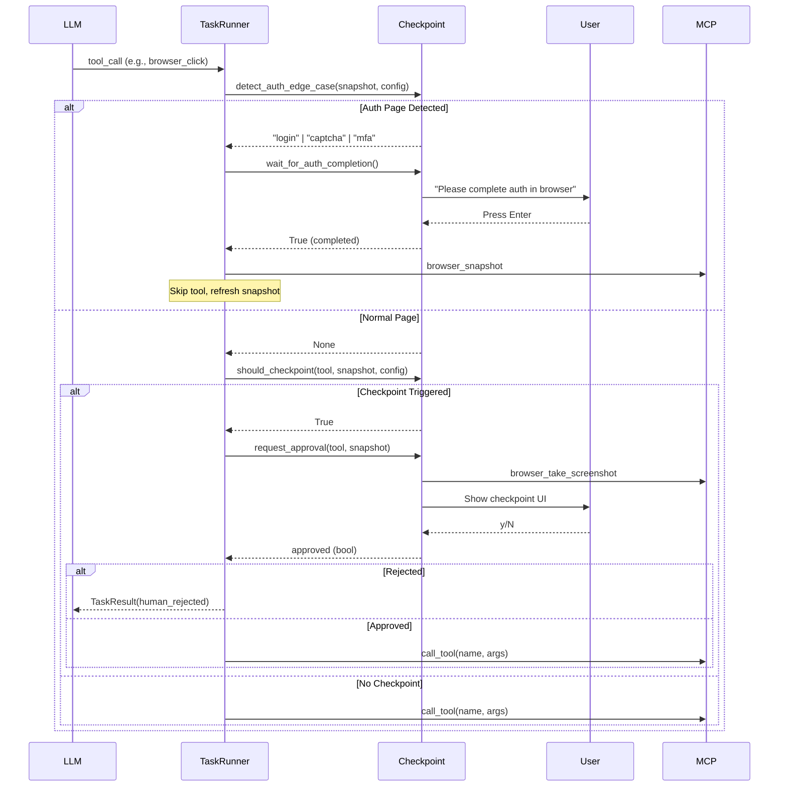
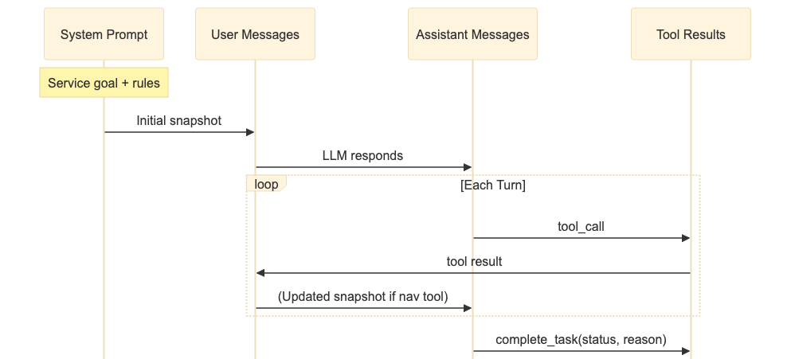
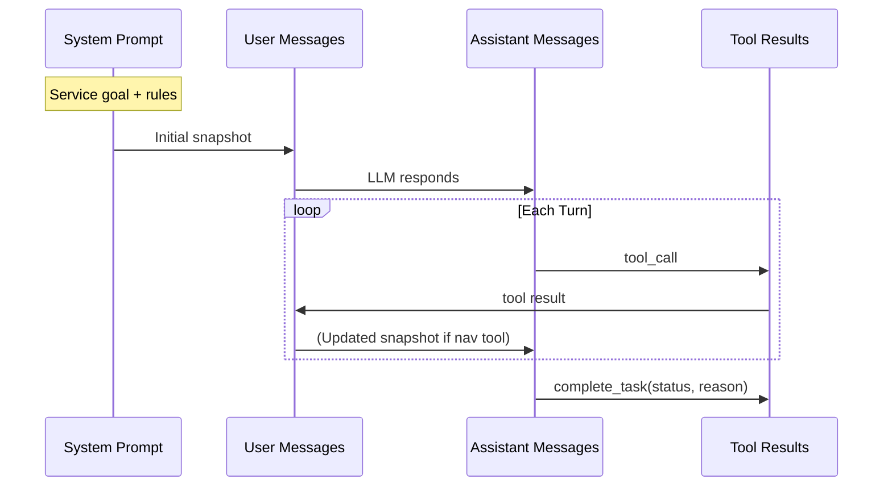

# SubTerminator Architecture

This document provides system design diagrams and component descriptions for the SubTerminator codebase.

---

## High-Level Architecture

Mermaid source

---

## MCP Orchestrator Flow

Mermaid source

---

## Component Descriptions

### CLI Layer

| Component | File | Responsibility |
|-----------|------|----------------|
| Command Parser | `cli/main.py` | Parse CLI arguments, create components, run orchestrator |
| Output Formatter | `cli/output.py` | Format progress messages, success/failure output |
| User Prompts | `cli/prompts.py` | Interactive service selection, confirmation dialogs |
| Accessibility | `cli/accessibility.py` | Plain mode, non-interactive mode support |

### Legacy Orchestrator (core/)

| Component | File | Responsibility |
|-----------|------|----------------|
| CancellationEngine | `core/engine.py` | Main loop, state handling, detection cascade |
| StateMachine | `core/states.py` | 12 states with explicit transitions |
| HeuristicInterpreter | `core/ai.py` | Fast URL/text pattern matching |
| ClaudeInterpreter | `core/ai.py` | Vision-based page analysis |
| PlaywrightBrowser | `core/browser.py` | Direct browser control with stealth |
| Protocols | `core/protocols.py` | Type definitions (State, BrowserProtocol) |

### MCP Orchestrator (mcp_orchestrator/)

| Component | File | Responsibility |
|-----------|------|----------------|
| TaskRunner | `task_runner.py` | Main loop, virtual tools, turn management |
| LLMClient | `llm_client.py` | Claude/GPT-4 via LangChain, retries |
| MCPClient | `mcp_client.py` | Playwright MCP server subprocess |
| CheckpointHandler | `checkpoint.py` | Auth detection, approval UI |
| SnapshotParser | `snapshot.py` | Parse browser_snapshot to structured data |
| Types | `types.py` | TaskResult, ToolCall, NormalizedSnapshot |
| Exceptions | `exceptions.py` | Custom error types |
| ServiceConfig | `services/base.py` | Service configuration dataclass |
| ServiceRegistry | `services/registry.py` | Service lookup by name |

### Services

| Component | File | Responsibility |
|-----------|------|----------------|
| Netflix (Legacy) | `services/netflix.py` | URLs, selectors, text indicators |
| Netflix (MCP) | `mcp_orchestrator/services/netflix.py` | URLs, predicates, LLM hints |
| Service Registry | `services/registry.py` | Service lookup, validation |
| Mock Server | `services/mock.py` | Local testing server |

### Utilities

| Component | File | Responsibility |
|-----------|------|----------------|
| Config | `utils/config.py` | Environment variable handling |
| Exceptions | `utils/exceptions.py` | Shared exception types |
| Session Logger | `utils/session.py` | Screenshot and log capture |

---

## Data Types

### MCP Orchestrator Types

Mermaid source

---

## Checkpoint Flow

Mermaid source

---

## Tool Execution

### Available MCP Tools

| Tool | Description |
|------|-------------|
| `browser_navigate` | Navigate to URL |
| `browser_click` | Click element by ref |
| `browser_type` | Type into input field |
| `browser_snapshot` | Get page accessibility tree |
| `browser_take_screenshot` | Capture screenshot |

### Virtual Tools

| Tool | Description |
|------|-------------|
| `complete_task` | Signal success or failure |
| `request_human_approval` | Request explicit approval |

---

## Message Flow

Mermaid source

The message history accumulates:
1. System prompt with goal
2. User message with page snapshot
3. Assistant tool_call
4. Tool result
5. (If navigation) User message with updated snapshot
6. Repeat until complete_task
