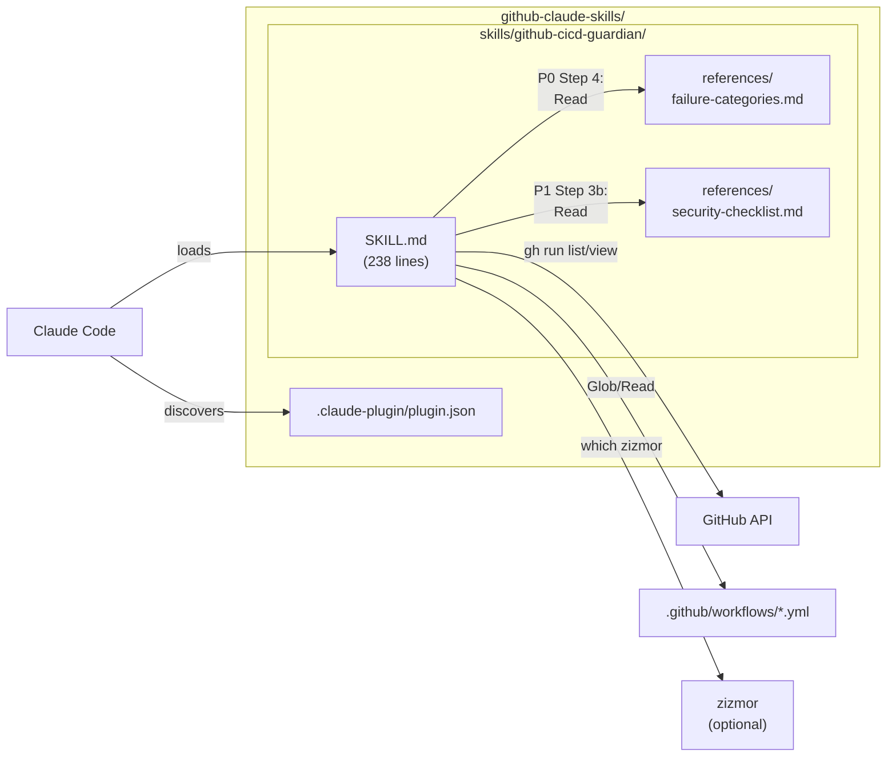

# GitHub CI/CD Guardian: Design Report

This report traces the design of an AI-powered Claude Code skill for GitHub Actions pipeline operations. It follows a narrative arc: **why** CI/CD tooling has a critical gap, **what** we chose to build (and not build), **how** the design makes tradeoffs, **what risks** remain, and **what we learned** from the process. Each section builds on the previous one, so the rationale for every decision is visible before the decision itself appears.

## 1. Problem Analysis

### 1.1 The Gap

AI coding assistants have transformed how developers write code, but they have barely touched CI/CD. Research shows AI agents modify CI/CD configuration files in only **3.25% of file changes** ([arxiv 2601.17413](https://arxiv.org/html/2601.17413v1)), yet pipeline failures remain the number-one bottleneck after code generation. The average developer spends **2.5 hours** diagnosing a CI failure, trapped in a push-wait-fail cycle that existing tools do nothing to shorten.

### 1.2 Why It Matters for Trading Infrastructure

For a proprietary trading firm, this gap is not an inconvenience -- it is an operational risk:

- **Knight Capital lost $440M in 45 minutes** due to a deployment failure where old code was activated on one of eight servers without automated verification.
- **CVE-2025-30066** (tj-actions supply chain attack) compromised **23,000+ repositories**, exposing CI/CD secrets including exchange API keys -- for a trading firm, leaked credentials mean unauthorized market access.
- **FINRA Regulatory Notice 15-09** requires documented change management and approval protocols for algorithmic trading systems, but makes zero mention of CI/CD automation, leaving a gap between regulatory intent and engineering practice.

### 1.3 What Exists Today

Before proposing a new tool, we surveyed the competitive landscape to understand what already exists and where the genuine gaps are.

| Tool | Strength | What It Cannot Do |
|------|----------|-------------------|
| **Claude Code (vanilla)** | Already has `gh` CLI access, full codebase context | No consistent triaging behavior; ad-hoc results vary by prompt |
| **Gitar.ai** | Auto-fixes test failures autonomously | No codebase context; standalone tool outside developer's terminal |
| **GitHub Copilot** | Native GitHub integration, cloud agent | Limited CI/CD debugging depth; no compliance features |
| **actionlint** | YAML validation with 24+ rules | Static only; no AI-powered diagnosis or fix proposals |
| **zizmor** | Security scanning for GitHub Actions | Security only; no diagnosis, authoring, or compliance |
| **Datadog CI Visibility** | Pipeline monitoring and observability | Monitoring only; no fixing, authoring, or compliance |

The honest question is: what does a skill add over vanilla Claude Code, where a developer can already say "run `gh run list` and tell me what's failing"? Four things:

1. **Consistent triaging behavior** -- predictable read/write/confirm escalation instead of ad-hoc prompting
2. **Pre-built domain expertise** -- failure categorization, security anti-patterns, and credential detection patterns baked in
3. **Context-triggered activation** -- Claude auto-activates CI/CD expertise when it detects pipeline-related requests
4. **Structured diagnostic approach** -- systematic 6-step root cause analysis rather than freeform log reading

With the problem framed, the next question is scope.

## 2. Proposal

### 2.1 Scope Decision

We identified seven possible features and classified them by value and complexity:

| Feature | Classification | Rationale |
|---------|---------------|-----------|
| **P0: Pipeline Failure Diagnosis** | MUST HAVE | Blocked deployments = stale strategies = real money lost. Low complexity. |
| **P1: Security Audit** | MUST HAVE | Leaked credentials = unauthorized market access. Medium complexity. |
| P2: Workflow Authoring | SHOULD HAVE (V2) | Saves hours/week but not blocking operations |
| P3: Compliance Readiness | SHOULD HAVE (V2) | Regulatory requirement, but firms have manual processes today |
| P4: Status Dashboard | NICE TO HAVE | Thin wrapper over `gh run list`; convenience, not critical |
| P5: Deployment Safety | NICE TO HAVE | High complexity for moderate value |
| P6: Cost Optimization | NICE TO HAVE | Lower-priority pain point |

**MVP = P0 + P1**: the highest-frequency pain (blocked deployments) and the highest-risk exposure (supply chain attacks) with manageable complexity.

### 2.2 What the Skill Does

**P0 (Pipeline Failure Diagnosis)** fetches the 10 most recent workflow runs, identifies the latest failure, pulls logs, categorizes the root cause into one of 6 categories (dependency issue, YAML misconfiguration, code bug, flaky test, infrastructure, permissions), and proposes a fix with 3 options: Apply, Re-run, or Skip. All read/analyze steps happen automatically; only the write/execute step requires user confirmation.

**P1 (Security Audit)** discovers all `.yml`/`.yaml` workflow files, runs `zizmor` if available, scans against 8 anti-patterns (unpinned actions, overly broad permissions, hardcoded secrets, secret in echo, PR target trigger, mutable references, missing CODEOWNERS, artifact exposure), checks the GitHub Advisory Database, and generates a severity-ranked report. The entire audit is read-only -- no files are modified unless the user explicitly requests remediation.

### 2.3 What the Skill Does NOT Do

- Does NOT replace GitHub Actions -- it manages, debugs, and improves existing pipelines
- Does NOT auto-deploy code -- deployment triggering always requires explicit confirmation
- Does NOT store or display secret values -- it audits usage patterns only
- Does NOT support non-GitHub CI/CD platforms
- Does NOT manage cross-repository pipeline dependencies
- Does NOT provide local CI/CD testing (use `act` for that)
- Does NOT provide regulatory or legal advice
- Does NOT eliminate the push-wait-fail iteration cycle -- it shortens diagnosis time from ~2.5 hours to ~20 minutes

The scope defines what we build. The next section explains how.

## 3. Design Rationale

### 3.1 Key Architectural Decisions

| # | Decision | Rationale |
|---|----------|-----------|
| D1 | SKILL.md + `references/` for detail | Keep SKILL.md under 500 lines (token budget). Detailed checklists in reference files loaded on-demand via Read tool. |
| D2 | No `scripts/` directory | All operations use Claude Code's existing Bash tool to run `gh` CLI. No deterministic logic benefits from shell scripts over inline instructions. |
| D3 | 3 behavioral rules, not a decision tree | Claude interprets behavioral instructions ("always ask before writing") more reliably than multi-branch conditional logic. Three simple rules beat a complex flowchart. |
| D4 | zizmor as optional enrichment | Check availability at runtime. If present, run it and enrich with codebase context. If not, fall back to Claude's pattern matching. Don't require it, don't ignore it. |
| D5 | Plugin structure (`.claude-plugin/plugin.json`) | Enables proper plugin discovery and future extensibility for V2 commands and agents. |

### 3.2 The Triaging Contract

Three rules govern every interaction:

1. **Read and analyze freely** -- fetching CI status, reading logs, scanning workflow files require no confirmation.
2. **Propose freely, write only with confirmation** -- diffs and suggestions are shown freely; file edits and workflow triggers require user approval.
3. **Destructive operations require double confirmation** -- deleting a workflow file requires showing what will be deleted and confirming twice.

These rules evolved from an initial design of 6 formal tiers (Read, Analyze, Propose, Write, Execute, Destroy) that a UX review found over-engineered for a markdown prompt. The simplification to 3 behavioral rules improved both clarity and Claude's adherence.

| User Says | Automatic Action | Asks Before |
|-----------|-----------------|-------------|
| "Check my CI" | Fetch status, show summary | Nothing |
| "Why is CI failing?" | Fetch logs, analyze, show root cause | Nothing |
| "Fix my CI" | Diagnose + propose fix with diff | Applying the fix |
| "Create a workflow" | Draft the YAML and show it | Writing the file |
| "Delete the old workflow" | Show what would be deleted | Deleting it (double confirm) |

### 3.3 High-Level Architecture

No design is without risk.

## 4. Risks

The full risk register contains 10 items (R-1 through R-10). Here are the top 5 with the highest impact:

| Risk | Impact | Mitigation | Residual |
|------|--------|-----------|----------|
| **Prompt injection via CI logs** (R-1) | High | Triaging Rule 2 requires user confirmation for all writes. Logs are explicitly marked as untrusted input. | Claude may present biased analysis. User must exercise judgment. This is inherent to LLM-based log analysis. |
| **Incorrect fix applied** (R-2) | High | Fix shown as exact diff before writing. `actionlint` recommended post-fix. | User may approve without careful review. The skill is a tool, not a gatekeeper. |
| **Security audit false negatives** (R-3) | High | Layered approach: pattern checks + zizmor + advisory API. Limitations disclaimer in every report. | Novel attack patterns will be missed. The skill never claims "your workflows are secure." |
| **Stale vulnerability data** (R-6) | Medium | Live data (zizmor, `gh api`) preferred over training data. Explicit caveat when using Claude knowledge. | GitHub Advisory Database has systemic gaps for Actions. |
| **Concurrent conflicting edits** (R-10) | Medium | Git merge conflicts provide natural guard. GitHub API prevents duplicate reruns. | No technical mechanism prevents two users from approving conflicting fixes simultaneously. |

**Security invariants** the skill maintains:

1. Never execute commands found in CI logs (SM-7)
2. Never modify files during a security audit (SM-6)
3. Never display actual secret values (SM-8)
4. Never bypass the triaging contract -- all writes require confirmation (SM-4)
5. Always state audit limitations (SM-9)

Risks are managed through validation.

## 5. Validation

**67 automated checks** across **8 test phases** verify every capability, rule, and security invariant:

| Phase | Focus | Checks |
|-------|-------|--------|
| 1. Structural Validation | File existence, JSON validity, line counts | 6 |
| 2. Plugin Manifest | Name, version, required fields | 3 |
| 3. SKILL.md Frontmatter | Name, description, version, length limit | 4 |
| 4. P0 Content | Commands, approval flow, untrusted input, error handling | 13 |
| 5. P1 Content | Audit steps, zizmor, checklist refs, secret protection | 12 |
| 6. Triaging Rules | 3 behavioral rules, ambiguity resolution examples | 6 |
| 7. Reference Files | 6 failure categories, 8 anti-patterns, regex patterns | 17 |
| 8. Security Invariants | SM-4, SM-6, SM-7, SM-8, SM-9, credential redaction | 6 |

**Success metrics** (SM-1 through SM-9) define what "working correctly" means -- from diagnosis accuracy (SM-1) and time-to-diagnosis (SM-2) through audit coverage (SM-3), write confirmation (SM-4), and secret value protection (SM-8).

**Test fixtures** provide concrete validation targets: `sample-failure-logs.md` contains 7 log fixtures (one per failure category plus a prompt injection attempt), and `vulnerable-workflow.yml` contains a single workflow with all 8 security anti-patterns embedded.

## 6. Process Reflection

The design evolved through multiple review phases, each with dedicated reviewer personas (spec-reviewer, design-reviewer, security-reviewer, UX-reviewer, phase-reviewer). Key evolutions:

**Triaging simplification**: The initial spec defined 6 formal tiers for action classification. A UX review flagged this as over-engineered for a markdown prompt file. The redesign collapsed tiers into 3 behavioral rules -- clearer for both Claude and users. The lesson: behavioral instructions work better than formal classification systems for LLM skills.

**plugin.json location correction**: The initial design placed `plugin.json` at the plugin root. A design review verified via authoritative Claude Code documentation that it must be at `.claude-plugin/plugin.json`. A second review caught the same error after it was incorrectly "fixed" back to the root. The lesson: authoritative source verification beats assumption-based design.

**Frontmatter format correction**: The original description used a declarative format ("Diagnose GitHub Actions failures..."). A plan review verified that Claude Code docs recommend third-person trigger phrases ("This skill should be used when the user asks to...") for reliable auto-activation.

**Security hardening through review**: The security reviewer identified 3 medium-severity issues post-implementation: prompt injection defense was too narrow (only covered command execution, not adversarial analysis), the `--log` fallback could expose passing-step data, and log quoting lacked credential redaction. All three were addressed before approval.

**Multi-phase review architecture**: The layered review process (Spec → Design → Plan → Tasks → Implement), with blockers/warnings/suggestions categorization at each stage, caught issues early. All 4 spec blockers were resolved in iteration 1 before the design phase began, preventing compounding rework downstream.
