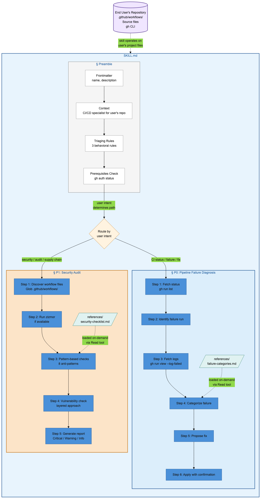
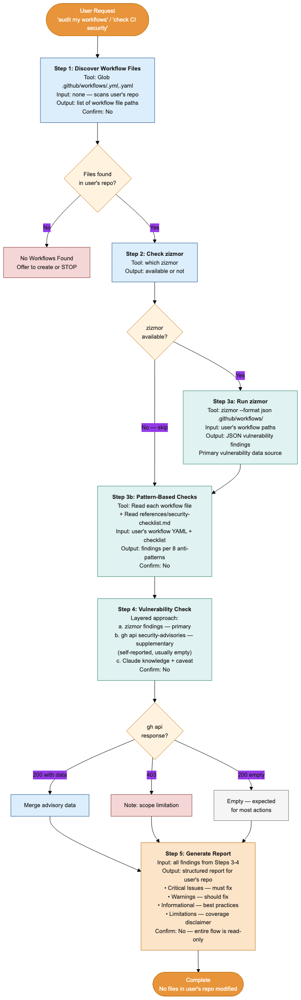
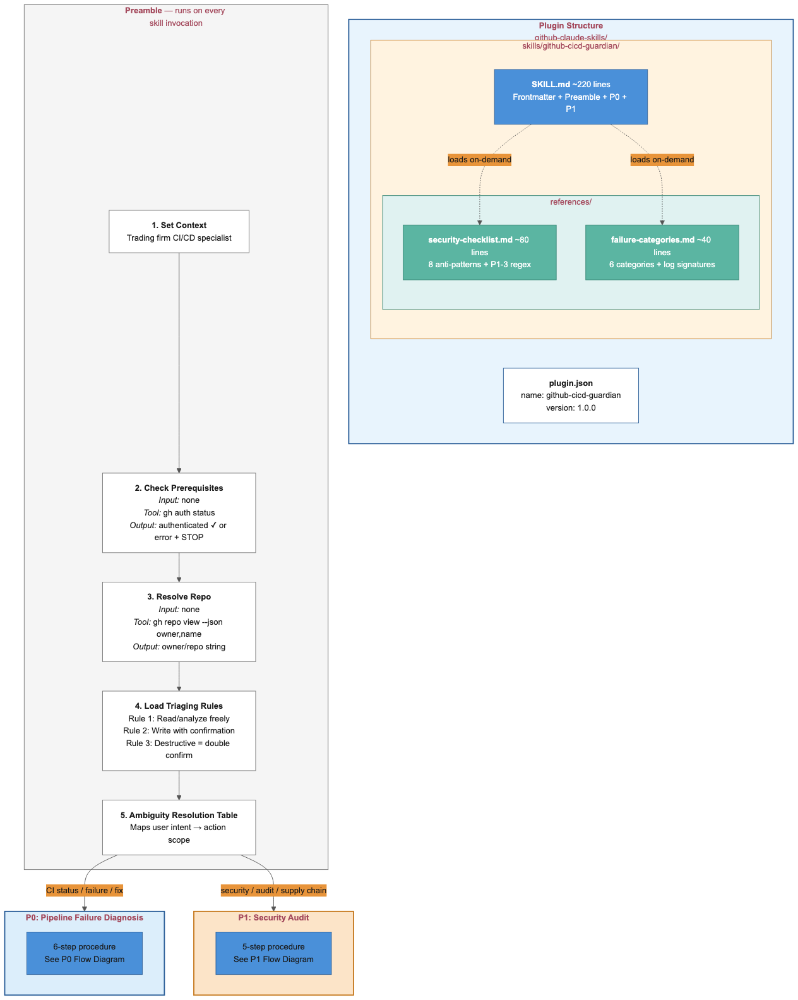

# Design: GitHub CI/CD Guardian Skill

## Prior Art Research

### Codebase Patterns
- **No existing skills or plugin structure** in this codebase -- this is the first skill file
- **This development repo's CI workflow** (`.github/workflows/ci.yml`) uses unpinned action tags (`@v4`, `@v5`, `@v3`) and no explicit top-level `permissions:` block on most jobs -- useful as a realistic test target since it exhibits P1-1 (unpinned actions) and P1-2 (overly broad permissions) anti-patterns. Note: `${{ github.ref_name }}` is used in a `run:` block but is a push-event context value, not a PR-attacker-controlled input like `github.event.pull_request.title` (P1-4). The skill operates on the **end user's** repo, not this development repo
- **Empty scaffold** at `github-claude-skills/` with only a README

### External Prior Art
- **Anthropic's skill-creator template**: `SKILL.md` + optional `scripts/`, `references/`, `assets/` subdirectories
- **Trail of Bits security skills**: Domain-organized, pattern-based detection, configuration scanning
- **Token efficiency research**: Keep SKILL.md under 500 lines; use `references/` for detailed content loaded as-needed; stack unchanging context at top for cached token processing
- **Auto-triggering reliability**: Description field matching alone has low activation rates ([source](https://scottspence.com/posts/how-to-make-claude-code-skills-activate-reliably)); specific intent-matching keywords improve reliability significantly
- **Anti-patterns to avoid**: Time-sensitive content in SKILL.md, offering too many tool options, inconsistent terminology

---

## 1. Architecture Overview

### What We're Building

A Claude Code plugin that end users install into **their own projects**. Once installed, Claude Code gains CI/CD expertise and operates on the user's repository -- reading their `.github/workflows/` files, fetching their pipeline logs via `gh` CLI, and auditing their workflow security.

**Important distinction**: This repository (`vici_assessment-github-claude-skills`) is the **development repository** that produces the plugin. The plugin's CI/CD features operate on whichever repository the end user has open in Claude Code, not on this development repository. All references to workflow files, `gh run list`, security audits, etc. refer to the **end user's project**.

The plugin contains a single `SKILL.md` file (~200-400 lines) that encodes two capabilities:

1. **P0: Pipeline Failure Diagnosis & Fix** -- a step-by-step workflow that Claude follows when users ask about CI failures in their project
2. **P1: Security Audit & Supply Chain Protection** -- a structured checklist and procedure for auditing the user's workflow files

The skill file IS the architecture. There are no runtime components, no APIs, no state. It's a markdown document that shapes Claude's behavior through structured instructions.

### Plugin Directory Structure

Claude Code requires `plugin.json` inside a `.claude-plugin/` directory at the plugin root. The plugin root is registered via `.claude/plugins.json` or Claude Code's plugin discovery.

```
github-claude-skills/
├── .claude-plugin/
│   └── plugin.json                      # Plugin manifest (required location per Claude Code spec)
└── skills/
    └── github-cicd-guardian/
        ├── SKILL.md                     # The skill file (primary deliverable)
        └── references/
            ├── security-checklist.md    # Detailed 8-item anti-patterns checklist + P1-3 regex patterns
            └── failure-categories.md    # P0-3 failure categorization reference
```

**Plugin registration**: An end user installs this plugin into their own project by adding the `github-claude-skills/` directory path to their Claude Code plugins configuration. Once registered, Claude Code discovers `.claude-plugin/plugin.json` at the plugin root and loads skills from `skills/` subdirectories. The skill then operates on the user's repository -- scanning their `.github/workflows/`, fetching their pipeline logs, and auditing their workflow security.

### Key Architectural Decisions

| # | Decision | Rationale | Alternative Considered |
|---|----------|-----------|----------------------|
| D1 | **Single SKILL.md + references/ for detail** | SKILL.md stays under 500 lines (token budget). Detailed checklists and categorization tables go in `references/` loaded as-needed by Claude via Read tool | Everything in one file (exceeds token budget); scripts/ for logic (unnecessary -- all operations are `gh` CLI via Bash) |
| D2 | **No scripts/ directory** | All operations use Claude Code's existing Bash tool to run `gh` CLI commands. There's no deterministic logic that benefits from being in a script vs. inline in the skill | Shell scripts for `gh` CLI wrappers (adds indirection without benefit; Claude can run `gh` directly) |
| D3 | **Plugin structure, not standalone file** | `.claude-plugin/plugin.json` enables proper plugin discovery and future extensibility (V2 commands, agents). A standalone `SKILL.md` would work but limits growth | Standalone SKILL.md (works for MVP but precludes V2 slash commands or hooks without restructuring) |
| D4 | **Triaging encoded as behavioral rules, not conditional logic** | Claude interprets behavioral instructions ("always ask before writing") more reliably than decision trees with multiple branches. Three simple rules > complex flowchart | Formal decision tree in SKILL.md (brittle -- Claude may not follow multi-branch logic consistently) |
| D5 | **Prerequisites checked inline, not as a pre-hook** | Check `gh` availability at the start of each workflow within SKILL.md rather than a plugin hook. Simpler, fewer moving parts | PreToolUse hook that validates `gh` before any Bash call (over-engineered -- most Bash calls aren't `gh`) |
| D6 | **Structured output formats specified in SKILL.md** | Prescribe exact output format (headers, code blocks, severity labels) in the skill instructions so Claude produces consistent, parseable output | Freeform output (inconsistent formatting across invocations) |
| D7 | **zizmor integration as optional enrichment** | Check `which zizmor` and if available, run it first and enrich. If not, fall back to Claude's own pattern matching. Don't require it | Require zizmor (limits adoption); ignore zizmor (misses a reliable tool) |

### Component Model

The skill file has four logical sections, executed in sequence based on what the user asks. The diagram below is a simplified overview -- for authoritative step numbering (including the 2/3a/3b split in P1), see the interface tables in Section 2.4 and 2.5 and the detailed flow diagrams in Section 3.



**Color legend**: Blue (#4A90D9) = SKILL.md sections, Orange (#E8943A) = decision points, Teal (#5BB5A2) = reference files loaded on-demand.

### Token Budget

| Component | Est. Lines | Purpose |
|-----------|-----------|---------|
| Frontmatter + preamble | ~30 | Name, description, trading context, prerequisites |
| Triaging rules | ~30 | 3 rules + ambiguity table + action classification |
| P0: Diagnosis workflow | ~80 | Step-by-step diagnosis procedure |
| P1: Security audit workflow | ~80 | Step-by-step audit procedure |
| **SKILL.md total** | **~220** | Well under 500-line target |
| references/security-checklist.md | ~80 | 8 anti-patterns with detection patterns, examples, and P1-3 regex |
| references/failure-categories.md | ~40 | 6 failure categories with log signatures |
| **All files total** | **~340** | |

---

## 2. Interfaces & Contracts

### 2.1 Plugin Manifest (plugin.json)

```json
{
  "name": "github-cicd-guardian",
  "description": "AI-powered GitHub Actions CI/CD diagnosis and security auditing for trading systems",
  "version": "1.0.0"
}
```

### 2.2 Skill Frontmatter Contract

```yaml
---
name: GitHub CI/CD Guardian
description: This skill should be used when the user asks to "fix my CI", "why is CI failing", "audit workflow security", "check CI security", or mentions GitHub Actions failures, pipeline diagnosis, or CI/CD security audits.
version: 1.0.0
---
```

**Triggering format**: Uses third-person trigger phrases per Claude Code skill development docs for reliable auto-activation. Includes quoted user intents ("fix my CI", "audit workflow security") that match common prompts. ~199 characters, under the 200-character limit.

Note: The spec's original 97-char declarative description is superseded by this trigger-phrase format based on Claude Code's documented best practice. The `version` field is included per the standard SKILL.md frontmatter schema.

### 2.3 Preamble Section Contract

The preamble runs unconditionally when the skill is invoked. It:

1. **Sets context**: "You are operating as a CI/CD specialist for the user's GitHub Actions pipelines in this repository." (The trading firm context is encoded as domain expertise. While the skill is branded and optimized for trading firms per the spec, the CI/CD procedures themselves are functionally generic to GitHub Actions.)
2. **Checks prerequisites**: Instructs Claude to verify `gh` CLI before proceeding:
   - Run `gh auth status` (covers both installation and auth in one check)
   - If it fails, show the appropriate error from the error table and stop
3. **Resolves repository context**: Run `gh repo view --json owner,name --jq '.owner.login + "/" + .name'` to determine {owner}/{repo}. This works with both github.com and GHES. Store the result for use in P1 steps and report headers.
4. **States the triaging rules**: The 3 rules from spec Section 5.1, verbatim
5. **States the ambiguity resolution table**: The 5-row table from spec Section 5.2

### 2.4 P0 Interface: Pipeline Failure Diagnosis

**Entry conditions** (when Claude should follow this path):
- User asks about CI status, pipeline failures, build errors, or says "fix my CI"

**Step-by-step procedure encoded in SKILL.md:**

| Step | Action | Claude Tool | Output |
|------|--------|------------|--------|
| 1. Fetch status | If user provided a specific run ID, skip to Step 3. Otherwise: `gh run list --limit 10` | Bash | Summary table: run ID, workflow name, status, branch, time |
| 2. Identify failure | Select most recent failed run from Step 1 results | -- | Selected run-id |
| 3. Fetch logs | `gh run view {run-id} --log-failed`. If output is empty (known `gh` CLI reliability issue), fall back to `gh run view {run-id} --log` and apply P0-NF4 truncation (last 200 lines per failing step) | Bash | Raw log output |
| 4. Categorize | Match log patterns against failure categories | Read (references/failure-categories.md) | **Category**: {type} with quoted log evidence |
| 5. Propose fix | Generate fix based on category + codebase context | Read (source files) | 3-part output: explanation, diff/command, approval prompt |
| 6. Apply | Write file changes or run `gh run rerun`. After writing YAML changes, suggest running `actionlint` if available (per spec Section 7) | Write/Edit/Bash | Only after user confirms |

**Output format for Step 5** (prescribed in SKILL.md):

```markdown
### Diagnosis

**Category**: {dependency issue | YAML misconfiguration | code bug | flaky test | infrastructure | permissions}

**Evidence**:
> {quoted log lines}

### Proposed Fix

{plain-language explanation of why this fix addresses the root cause}

```diff
{the exact change -- diff format for file edits, command for retries}
```

**To apply this fix, I need your confirmation.** Would you like me to:
1. **Apply** the change above
2. **Re-run** the failed jobs (`gh run rerun {id} --failed`)
3. **Skip** -- you'll handle it manually
```

Note: Always present all three options as shown above; do not reduce to a simple yes/no. This gives the user explicit control over which action to take.

### 2.5 P1 Interface: Security Audit

**Entry conditions** (when Claude should follow this path):
- User asks about workflow security, supply chain, audit, or mentions "security"

**Step-by-step procedure encoded in SKILL.md:**

| Step | Action | Claude Tool | Output |
|------|--------|------------|--------|
| 1. Discover | `ls .github/workflows/*.yml .github/workflows/*.yaml` | Glob | List of workflow files |
| 2. Check zizmor | `which zizmor` | Bash | Available or not |
| 3a. If zizmor | `zizmor --format json .github/workflows/` | Bash | JSON findings |
| 3b. Always | Read each workflow file + check against anti-patterns | Read (workflow files + references/security-checklist.md) | Pattern match results |
| 4. Vulnerability check | Layered: (1) zizmor findings from Step 3a if available, (2) `gh api /repos/{owner}/{repo}/security-advisories` for action repos -- note: returns self-reported advisories only, usually empty, (3) Claude's training knowledge with explicit caveat | Bash | Known vulnerability notes (expect most data from zizmor or Claude knowledge, not gh api) |
| 5. Generate report | Compile all findings into structured report | -- | Formatted security report |

**Output format for Step 5** (prescribed in SKILL.md):

```markdown
## Security Audit Report

**Repository**: {owner}/{repo}
**Workflows scanned**: {count}
**Date**: {date}

### Critical Issues (must fix)
{numbered list with file:line references and remediation}

### Warnings (should fix)
{numbered list}

### Informational (best practices)
{numbered list}

### Limitations
This audit checks for common anti-patterns and known vulnerabilities but does not guarantee comprehensive coverage. GitHub Advisory Database does not index GitHub Actions as a first-class ecosystem. {if using Claude knowledge: "Vulnerability data is based on training data as of [date] and may be outdated."}
```

### 2.6 Reference File: security-checklist.md

Located at `references/security-checklist.md`. Loaded by Claude via Read tool during P1 Step 3b.

Contains the 8 anti-patterns from spec Section 3.2, each with:
- **Pattern name** and spec mapping (P1-1 through P1-7)
- **What to look for**: specific YAML patterns, `grep`-able strings, or regex patterns
- **Severity**: Critical / Warning / Informational
- **Remediation**: the specific fix to suggest

Additionally includes the **P1-3 hardcoded secret detection patterns** from the spec:
- AWS access keys: `AKIA[0-9A-Z]{16}`
- GitHub PATs: `ghp_[A-Za-z0-9_]{36}`
- Generic GitHub tokens: `gh[pousr]_[A-Za-z0-9_]{36,}`
- YAML key patterns: keys named `password`, `token`, `api_key`, `secret`, `credential` with inline string values

Example entries:
```
### 1. Unpinned Actions (P1-1) [Critical]
**Look for**: `uses:` lines with `@v*`, `@main`, `@master` instead of `@{40-char-sha}`
**Example bad**: `uses: actions/checkout@v4`
**Example good**: `uses: actions/checkout@b4ffde65f46336ab88eb53be808477a3936bae11`
**Remediation**: Pin to the full commit SHA of the current release tag

### 2. Overly Broad Permissions (P1-2) [Critical]
**Look for**: `permissions: write-all` or missing `permissions:` block at workflow or job level
**Example bad**: `permissions: write-all` or no `permissions:` key at all
**Example good**: `permissions: { contents: read, pull-requests: write }`
**Remediation**: Add explicit least-privilege `permissions:` block scoped to what the workflow actually needs

### 3. Hardcoded Secrets (P1-3) [Critical]
**Look for**: Known credential patterns in workflow YAML values
**Regex patterns**: `AKIA[0-9A-Z]{16}`, `ghp_[A-Za-z0-9_]{36}`, `gh[pousr]_[A-Za-z0-9_]{36,}`
**YAML key patterns**: `password:`, `token:`, `api_key:`, `secret:`, `credential:` with inline string values (not `${{ secrets.* }}`)
**Remediation**: Move value to GitHub Secrets and reference via `${{ secrets.SECRET_NAME }}`

### 4. Secret in Echo (P1-5) [Critical]
**Look for**: `echo ${{ secrets.*` or `echo "${{ secrets.*` in `run:` blocks
**Remediation**: Remove echo of secret values; use `--add-mask` if logging is needed

### 5. Pull Request Target Trigger (P1-7) [Warning]
**Look for**: `on: pull_request_target` combined with `actions/checkout` referencing PR head ref (`${{ github.event.pull_request.head.ref }}`)
**Remediation**: If checkout of PR code is needed with pull_request_target, use explicit SHA and restrict permissions

### 6. Mutable Action References (P1-1 subset) [Warning]
**Look for**: `uses:` lines with `@main`, `@master`, or other branch refs
**Remediation**: Pin to commit SHA

### 7. Missing CODEOWNERS (P1-7) [Informational]
**Look for**: Absence of `.github/CODEOWNERS` file or no entry covering `.github/workflows/`
**Remediation**: Add CODEOWNERS with team ownership for workflow files

### 8. Artifact Exposure (P1-7) [Warning]
**Look for**: `actions/upload-artifact` steps that reference directories potentially containing secrets, .env files, or credential stores
**Remediation**: Review artifact contents; exclude sensitive files from upload
```

### 2.7 Reference File: failure-categories.md

Located at `references/failure-categories.md`. Loaded by Claude via Read tool during P0 Step 4.

Contains the 6 failure categories from spec P0-3 with their log signature patterns:

| Category | Log Signatures | Example |
|----------|---------------|---------|
| Dependency issue | `ModuleNotFoundError`, `package not found`, `cannot resolve` | `ModuleNotFoundError: No module named 'foo'` |
| YAML misconfiguration | `unexpected value`, `mapping values are not allowed`, `workflow is not valid` | `Error: .github/workflows/ci.yml: unexpected value` |
| Code bug | `FAIL`, `AssertionError`, `Error:`, test failure patterns | `FAIL test_order_placement ... AssertionError` |
| Flaky test | Same test fails intermittently; exit code 143 (timeout) on re-run | `Error: Process completed with exit code 143` |
| Infrastructure | `No space left on device`, `runner is offline`, timeout without test failure | `No space left on device` |
| Permissions | `Resource not accessible by integration`, `403`, `insufficient permissions` | `Resource not accessible by integration` |

### 2.8 Error Handling Contract

Errors are handled inline in SKILL.md as conditional instructions. The skill prescribes specific error messages for each condition from spec Section 8:

```
Before any gh command, verify gh is available:
- Run: gh auth status
- If exit code != 0: Print the appropriate error message and STOP. Do not attempt workarounds.
```

For `gh` API errors during operation:
```
- 403 response → "Insufficient permissions. Likely missing scope: {inferred scope}. Run: gh auth refresh -s {scope}"
- 429 response → "GitHub API rate limit reached. Try again in {retry-after} minutes."
- Network error → "Cannot reach GitHub API. Check your network connection."
- `--log-failed` returns empty → Fall back to `gh run view {id} --log`, truncate per P0-NF4. If full logs also empty: "No logs available for this run. It may still be queued or logs may have expired."
```

---

## 3. Data Flow

### P0: Diagnosis Flow


**Color legend**: Blue (#4A90D9) = read/analyze steps (no confirmation), Orange (#E8943A) = write/execute steps (confirmation required), Teal (#5BB5A2) = reference file reads, Gray (#F5F5F5) = skip/fallback paths.

### P1: Security Audit Flow



**Color legend**: Blue (#4A90D9) = read/discover steps, Orange (#E8943A) = decision points, Teal (#5BB5A2) = reference file reads. Entire flow is read-only -- no confirmation needed at any step.

---

## 4. Risks & Mitigations (Design-Specific)

| Risk | Mitigation |
|------|-----------|
| **SKILL.md too long for token budget** | Token budget calculated at ~220 lines for SKILL.md. Detailed checklists in `references/` loaded on-demand. Monitor during implementation |
| **Claude doesn't follow step-by-step procedure** | Use numbered, imperative steps with explicit "THEN" transitions. Research shows Claude follows ordered lists more reliably than prose |
| **References not loaded when needed** | SKILL.md explicitly instructs: "Before categorizing, read `references/failure-categories.md`". Claude's Read tool is reliable for explicit file paths |
| **Auto-triggering doesn't activate** | Description uses high-signal keywords ("diagnose", "pipeline failures", "CI/CD"). If activation is unreliable, users can invoke the skill by name |
| **zizmor JSON output format changes** | Parse zizmor output defensively. If format is unexpected, log warning and fall back to manual pattern matching |
| **gh CLI output format varies between versions** | Use `--json` flag where available for structured output. For `gh run view --log-failed` (no JSON option), parse text output heuristically |
| **`gh run view --log-failed` returns empty** | Known `gh` CLI reliability issue ([#10551](https://github.com/cli/cli/issues/10551)). Design includes explicit fallback: try `--log-failed`, if empty try `--log` with P0-NF4 truncation |
| **P1 vulnerability API returns empty** | `gh api` security-advisories returns self-reported data only; most action repos have none. Design treats zizmor and Claude knowledge as primary sources, API check as supplementary |

---

## 5. Testing Strategy

Testing a skill file is fundamentally different from testing code. The skill is markdown instructions, not executable logic. Testing validates that Claude, when given these instructions, produces the expected behavior.

### Scenario-Based Testing

Each test is a user prompt + expected behavior pair:

| Scenario | User Prompt | Expected Behavior | Validates |
|----------|------------|-------------------|-----------|
| T1 | "Why is CI failing?" | Runs `gh run list`, identifies failure, fetches logs, categorizes, shows root cause. Does NOT propose fix unless asked | SM-2 (diagnosis in one interaction) |
| T2 | "Fix my CI" | Completes full P0 flow (diagnose + propose), asks once before applying | SM-4 (write confirmation), P0-6 |
| T3 | "Audit my workflow security" | Runs full P1 flow, produces report, does NOT modify any files | SM-6 (read-only audit) |
| T4 | "Delete the old workflow" | Shows what would be deleted, asks for confirmation twice | Rule 3 (double confirm) |
| T5 | Run with `gh` not installed | Shows error message and stops | SM-5 (prerequisite handling) |
| T6 | Workflow with all 8 anti-patterns | All 8 flagged in security report | SM-3 (audit coverage) |
| T7 | Log containing `run: rm -rf /` | Quoted as evidence, not executed | SM-7 (log injection resistance) |
| T8 | Audit on repo with secrets | Secret names shown, values never displayed | SM-8 (secret protection) |
| T9 | Full security audit | Report includes limitations disclaimer | SM-9 (coverage disclaimer) |

**Priority order**: T5 (prerequisite failure) and T7 (log injection resistance) guard security invariants and should be validated first. T6 (all 8 anti-patterns) validates core audit coverage. Remaining tests validate behavioral correctness.

### How to Execute Tests

1. **Manual scenario testing**: Run each prompt in Claude Code with the skill installed
2. **Git status check**: Before/after P1 audit to verify no file modifications (SM-6)
3. **Diff review**: For P0 fixes, verify the diff is shown before any write occurs
4. **Checklist verification**: For P1, create a test workflow with all 8 anti-patterns and verify detection

---

## 6. File Inventory

Files to create during implementation:

| File | Purpose | Est. Lines |
|------|---------|-----------|
| `github-claude-skills/.claude-plugin/plugin.json` | Plugin manifest (required location) | ~5 |
| `github-claude-skills/skills/github-cicd-guardian/SKILL.md` | Primary skill file | ~220 |
| `github-claude-skills/skills/github-cicd-guardian/references/security-checklist.md` | 8 anti-patterns + P1-3 regex patterns | ~80 |
| `github-claude-skills/skills/github-cicd-guardian/references/failure-categories.md` | 6 failure categories with log signatures | ~40 |

**Total**: 4 files, ~345 lines.

---

## 7. System Design Diagrams

All diagrams use a colorblind-friendly palette (blue/orange/teal) instead of red/green.

### 7.1 Architecture Overview

Shows the plugin structure, preamble execution flow, and routing to P0/P1 based on user intent.



**Color legend:**
- **Blue** (#4A90D9) — primary components (SKILL.md, start/end nodes, read actions)
- **Orange** (#E8943A) — secondary components (skill directory, decision points, write actions)
- **Teal** (#5BB5A2) — reference files (loaded on-demand)
- **Gray** (#F5F5F5) — neutral / skip actions

### 7.2 P0: Pipeline Failure Diagnosis Flow

Complete 6-step procedure with inputs, tools, outputs, and confirmation requirements at each step. Includes run-ID bypass path and `--log-failed` fallback.


**Step summary with I/O:**

| Step | Input | Tool | Output | Confirm? |
|------|-------|------|--------|----------|
| 1. Fetch Status | none (or skip if run ID given) | `gh run list --limit 10` | Run summary table | No |
| 2. Identify Failure | Run list | Selection logic | run-id | No |
| 3. Fetch Logs | run-id | `gh run view {id} --log-failed` (fallback: `--log`) | Failure logs | No |
| 4. Categorize | Logs + references/failure-categories.md | Read | Category + evidence | No |
| 5. Propose Fix | Category + source files | Read | Explanation + diff + options | No |
| 6. Apply | User choice | Write/Edit or `gh run rerun` | File modified or run triggered | **Yes** |

### 7.3 P1: Security Audit Flow

Complete 5-step procedure with layered vulnerability checking. Entire flow is read-only -- no confirmation needed at any step.


**Step summary with I/O:**

| Step | Input | Tool | Output | Confirm? |
|------|-------|------|--------|----------|
| 1. Discover Files | none | Glob `.github/workflows/*.yml` | File paths | No |
| 2. Check zizmor | none | `which zizmor` | Available? | No |
| 3a. Run zizmor | Workflow paths | `zizmor --format json` | JSON findings | No |
| 3b. Pattern Checks | Files + references/security-checklist.md | Read | 8 anti-pattern findings | No |
| 4. Vulnerability Check | Action repos | zizmor data / `gh api` / Claude knowledge | Vulnerability notes | No |
| 5. Generate Report | All findings | Compile | Critical/Warning/Info + Limitations | No |
