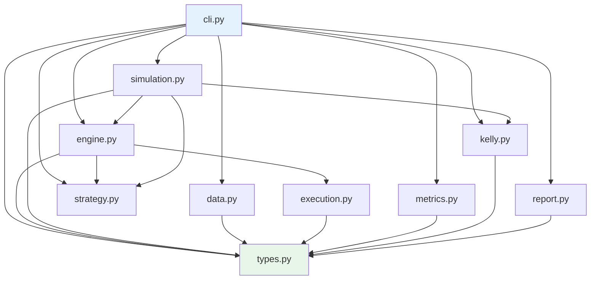

# Technical Guide

Onboarding reference for engineers contributing to the stock-backtester codebase.

## Table of Contents

- [Project Layout](#project-layout)
- [Module Dependency Graph](#module-dependency-graph)
- [Module Responsibility Table](#module-responsibility-table)
- [Pipeline 1: `backtest run`](#pipeline-1-backtest-run)
- [Pipeline 2: `backtest simulate`](#pipeline-2-backtest-simulate)
- [Pipeline 3: `backtest verify`](#pipeline-3-backtest-verify)
- [Module Reference](#module-reference)
  - [types.py](#typesspy)
  - [data.py](#datapy)
  - [strategy.py](#strategypy)
  - [execution.py](#executionpy)
  - [engine.py](#enginepy)
  - [metrics.py](#metricspy)
  - [kelly.py](#kellypy)
  - [simulation.py](#simulationpy)
  - [report.py](#reportpy)
  - [cli.py](#clipy)
- [Acceptance Criteria Reference](#acceptance-criteria-reference)
- [Test Organization](#test-organization)
- [Development Setup](#development-setup)
- [How to Extend](#how-to-extend)

---

## Project Layout

```
stock-backtester/
  src/stock_backtester/        # 12 source files
    __init__.py                # Package version ("0.1.0")
    __main__.py                # Entry: imports cli.app and calls it
    types.py                   # Frozen dataclasses + OutputFormat enum
    data.py                    # Price fetching via yfinance
    strategy.py                # Strategy ABC + implementations
    execution.py               # Return computation + transaction costs
    engine.py                  # Vectorized backtesting engine
    metrics.py                 # Performance metrics (Sharpe, Sortino, drawdown)
    kelly.py                   # Kelly criterion + ruin analysis
    simulation.py              # GBM calibration, Monte Carlo, verification tests
    report.py                  # TABLE/JSON output formatting
    cli.py                     # Typer CLI (run, simulate, verify)
  tests/                       # 12 test files + conftest.py (88 tests total)
  docs/                        # This guide + feature specs
  pyproject.toml               # Project config, dependencies, tool settings
```

Entry point: `pyproject.toml` L26-27 defines `backtest = "stock_backtester.cli:app"`.

---

## Module Dependency Graph



**Leaf nodes** (no project imports): `types.py`, `strategy.py`.

---

## Module Responsibility Table

| Module | LOC | Responsibility | Imports From |
|--------|-----|----------------|--------------|
| `types.py` | 115 | Frozen dataclasses (9) + `OutputFormat` enum | *(leaf — dataclass, Enum, pandas)* |
| `data.py` | 75 | yfinance fetching, price validation, date alignment | `types` |
| `strategy.py` | 47 | Strategy ABC, `EqualWeightStrategy`, `AlwaysLongStrategy`, factory | *(leaf — abc, pandas)* |
| `execution.py` | 66 | Simple/log returns, trailing volatility, slippage + commission | `types` |
| `engine.py` | 64 | 8-step vectorized backtest pipeline | `execution`, `strategy`, `types` |
| `metrics.py` | 83 | Sharpe, Sortino, drawdown, win rate, annualized return/vol | `types` |
| `kelly.py` | 105 | Kelly fraction, ruin probability, critical Kelly, frontier | `types` |
| `simulation.py` | 578 | GBM calibration/generation, Monte Carlo, 8 verification tests | `engine`, `kelly`, `strategy`, `types` |
| `report.py` | 196 | TABLE + JSON formatting for all three commands | `types` |
| `cli.py` | 128 | Typer app with `run`, `simulate`, `verify` commands | `data`, `engine`, `kelly`, `metrics`, `report`, `simulation`, `strategy`, `types` |

---

## Pipeline 1: `backtest run`


**Critical detail:** `shift(1)` at `engine.py:21` is the single temporal alignment point. Weights computed on day *t* are applied to returns on day *t+1*, preventing look-ahead bias.

---

## Pipeline 2: `backtest simulate`


---

## Pipeline 3: `backtest verify`


---

## Module Reference

### types.py

**Purpose:** Immutable data containers shared across all modules.

**Exports:** 1 enum + 9 frozen dataclasses.

| Type | Lines | Fields |
|------|-------|--------|
| `OutputFormat` | L7-9 | `TABLE`, `JSON` |
| `BacktestConfig` | L12-23 | `symbols`, `start_date`, `end_date`, `strategy_name`, `strategy_params`, `commission_per_share`, `slippage_k`, `ruin_threshold`, `drawdown_level`, `output_format` |
| `SimulationConfig` | L26-39 | Same as `BacktestConfig` + `n_paths`, `seed` |
| `PriceData` | L42-48 | `prices` (dict[str, DataFrame]), `symbols`, `source`, `adjusted`, `aligned_dates` |
| `BacktestResult` | L51-60 | `config`, `gross_returns`, `net_returns`, `weights`, `slippage_costs`, `commission_costs`, `equity_curve`, `warmup_end_idx` |
| `KellyResult` | L63-72 | `mu_daily`, `sigma_daily`, `full_kelly`, `half_kelly`, `critical_kelly`, `frontier`, `ruin_threshold`, `drawdown_level` |
| `FrontierRow` | L75-80 | `fraction_label`, `fraction_of_fstar`, `growth_pct_of_max`, `ruin_probability` |
| `MetricsResult` | L83-94 | `sharpe`, `sortino`, `max_drawdown`, `max_drawdown_duration_days`, `annualized_return`, `annualized_volatility`, `win_rate`, `gross_return_total`, `net_return_total`, `cost_drag` |
| `SimulationResult` | L97-104 | `n_paths`, `seed`, `per_symbol_calibrations`, `empirical_ruin_rate`, `theoretical_ruin_rate`, `path_results` |
| `VerificationResult` | L107-114 | `test_name`, `passed`, `expected`, `actual`, `tolerance`, `detail` |

**No project imports** — this is a leaf module.

---

### data.py

**Purpose:** Fetch and validate historical price data via yfinance.

**Exports:** `DataError`, `validate_prices`, `align_dates`, `fetch_prices`.

| Function | Lines | Description |
|----------|-------|-------------|
| `validate_prices(df, symbol)` | L11-23 | Checks for NaN close prices, non-positive values, and minimum 30 bars |
| `align_dates(price_dfs)` | L26-33 | Intersects date indices across all symbols, returns sorted `DatetimeIndex` |
| `fetch_prices(symbols, start, end)` | L36-74 | Downloads via `yf.download` with `auto_adjust=True`, `multi_level_index=False` (L42-48); normalizes columns via `.str.lower()` (L51); validates each symbol; aligns dates; enforces 30-bar minimum on aligned data (L59-62) |

**yfinance settings:** `auto_adjust=True` means prices are adjusted for stock splits and dividends. `multi_level_index=False` returns a flat DataFrame per symbol.

---

### strategy.py

**Purpose:** Strategy interface and implementations.

**Exports:** `StrategyError`, `Strategy`, `EqualWeightStrategy`, `AlwaysLongStrategy`, `get_strategy`.

| Class/Function | Lines | Description |
|----------------|-------|-------------|
| `Strategy` (ABC) | L10-18 | Abstract: `compute_weights(prices, symbols) -> DataFrame`, `warmup_bars -> int` |
| `EqualWeightStrategy` | L21-31 | Returns `1/n` weight for each symbol on every date. `warmup_bars = 0` |
| `AlwaysLongStrategy` | L34-37 | Subclass of `EqualWeightStrategy` — identical behavior, separate name |
| `get_strategy(name, params)` | L40-46 | Factory: `"equal-weight"` or `"always-long"`, raises `StrategyError` otherwise |

**No project imports** — this is a leaf module (uses only `abc` and `pandas`).

---

### execution.py

**Purpose:** Return computation and transaction cost modeling.

**Exports:** 6 functions.

| Function | Lines | Description |
|----------|-------|-------------|
| `compute_simple_returns(df)` | L7-8 | `close.pct_change()` |
| `compute_log_returns(df)` | L11-13 | `ln(close / close.shift(1))` |
| `compute_multi_symbol_simple_returns(prices)` | L16-20 | Simple returns per symbol as DataFrame |
| `compute_multi_symbol_log_returns(prices)` | L23-27 | Log returns per symbol as DataFrame |
| `compute_trailing_volatility(log_returns, window=20)` | L30-37 | Rolling std (window=20, ddof=1, min_periods=2); expanding fallback for early bars; `fillna(0.0)` |
| `compute_costs(prices, weights, slippage_k, commission_per_share)` | L40-65 | Computes per-symbol slippage + commission, returns aggregated series |

**Transaction cost formulas:**

- `delta_w = weights.diff().fillna(weights)` (L50) — first bar treats full weight as a trade
- **Slippage:** `slippage_k * trailing_vol * |delta_w|` (L57-59)
- **Commission:** `(commission_per_share / close_price) * |delta_w|` (L61-63)

---

### engine.py

**Purpose:** Core 8-step vectorized backtesting pipeline.

**Signature:** `run_backtest(config: BacktestConfig, prices: PriceData, strategy: Strategy) -> BacktestResult`

**Steps:**

| Step | Line(s) | Operation |
|------|---------|-----------|
| 1 | L17-18 | Copy prices, compute raw weights via strategy |
| 2 | L21 | `shift(1)` weights — **single temporal alignment point** preventing look-ahead |
| 3 | L24 | Compute per-symbol simple returns |
| 4 | L28 | Portfolio simple return: `R_p = sum(w_i * R_i)` (cross-sectional, NOT log) |
| 5 | L31 | Convert to log-return: `r_p = ln(1 + R_p)` |
| 6 | L34-36 | Compute slippage + commission costs |
| 7 | L40 | Net returns: `gross - slippage - commission` |
| 8 | L49-52 | Equity curve: `exp(cumsum(net))`, normalized to 1.0 at `warmup_end_idx` |

**Why simple returns at Step 4:** Cross-sectional aggregation of log-returns would introduce Jensen's inequality bias. The engine aggregates simple returns, then converts to log for time-series accumulation. AC-1b explicitly tests this property.

---

### metrics.py

**Purpose:** Compute performance metrics from post-warmup returns.

**Signature:** `compute_metrics(net_returns, gross_returns, warmup_end_idx) -> MetricsResult`

| Metric | Lines | Formula | Notes |
|--------|-------|---------|-------|
| Sharpe | L15-22 | `(mean_r * 252) / (std_r * sqrt(252))` | ddof=1 (sample std); returns 0.0 if std=0 or NaN |
| Sortino | L24-32 | `(mean_r * 252) / (dd_annual)` where `dd_daily = sqrt(sum(min(r,0)^2) / N)` | Full-count convention: N = total bar count; returns `inf` if no downside |
| Max drawdown | L34-38 | `min(equity / running_max - 1)` | Recomputes equity from `exp(cumsum(net))` independently |
| Max drawdown duration | L40-51 | Consecutive bars in drawdown | Simple loop counter |
| Win rate | L53-58 | `count(positive) / count(nonzero)` | Excludes zero-return bars |
| Annualized return | L61 | `exp(mean_r * 252) - 1` | Geometric (continuous compounding) |
| Annualized volatility | L64 | `std_r * sqrt(252)` | Same ddof=1 as Sharpe |
| Cost drag | L67-69 | `gross_total - net_total` | Sum of all transaction costs |

---

### kelly.py

**Purpose:** Kelly criterion sizing, ruin probability, and capital efficiency frontier.

**Exports:** `KellyError`, `ruin_probability`, `growth_rate_fraction`, `critical_kelly_fraction`, `compute_kelly`.

| Function | Lines | Description |
|----------|-------|-------------|
| `ruin_probability(f, f_star, d)` | L12-18 | `P = D^(2/alpha - 1)` where `alpha = f/f*`. Special cases: `f <= 0 -> 0.0`, `alpha >= 2 -> 1.0` |
| `growth_rate_fraction(alpha)` | L21-22 | `g(alpha) = 2*alpha - alpha^2` (fraction of max growth rate) |
| `critical_kelly_fraction(mu, sigma, ruin_threshold, drawdown_level)` | L25-39 | Closed-form: `f_crit = 2*mu / (sigma^2 * (ln(P)/ln(D) + 1))`. Returns `None` if `mu <= 0` or `f_crit >= 2*f*` |
| `compute_kelly(net_returns, warmup_end_idx, ...)` | L42-104 | Main entry. Uses **ddof=0** at L55 (population/MLE variance). `f* = mu/sigma^2` (L60), `half_kelly = f*/2` (L62). Builds 6-point frontier at alphas `[0.25, 0.50, 0.75, 1.00, 1.50, 2.00]` (L81) |

**ddof note:** Kelly uses `ddof=0` (population variance) because the Kelly formula is a plug-in MLE estimator. Sharpe/Sortino use `ddof=1` (sample variance, Bessel correction) because they are inferential statistics.

---

### simulation.py

**Purpose:** GBM calibration, path generation, Monte Carlo simulation, and 8 verification tests.

**Exports:** `SimulationError`, `calibrate_gbm`, `generate_gbm_paths`, `generate_multi_symbol_paths`, `check_ruin`, `run_monte_carlo`, `run_verification_tests`.

| Function | Lines | Description |
|----------|-------|-------------|
| `calibrate_gbm(prices)` | L26-38 | Log-return mean/std with **ddof=1** (L34), annualized by `*252` and `*sqrt(252)` (L35-36) |
| `generate_gbm_paths(mu, sigma, n_paths, n_days, seed, s0=100.0)` | L41-59 | Ito-corrected drift: `(mu - 0.5*sigma^2)*dt` (L52). Returns array of shape `(n_paths, n_days+1)` |
| `generate_multi_symbol_paths(calibrations, n_paths, n_days, seed)` | L62-71 | Per-symbol: `seed+i` (L70) for independent streams |
| `check_ruin(equity, drawdown_level)` | L74-77 | `drawdown.min() < -drawdown_level` |
| `run_monte_carlo(prices, strategy, config)` | L80-170 | Historical backtest (L98) -> Kelly (L102-112) -> calibrate -> generate paths -> per-path loop (L130-156) with half-Kelly scaling (L153) and ruin check (L155) |
| `run_verification_tests(seed=42)` | L173-577 | Runs AC-1 through AC-7 (+ AC-1b), returns `list[VerificationResult]` |

**Verification test locations:**

| Test | Lines | Description |
|------|-------|-------------|
| AC-1 | L176-237 | Deterministic 1% daily returns |
| AC-1b | L239-303 | Multi-symbol equal-weight aggregation |
| AC-2 | L305-354 | Look-ahead prevention (perfect foresight) |
| AC-3 | L356-395 | Slippage invariant (net < gross) |
| AC-4 | L397-425 | Kelly analytical (f* = mu/sigma^2) |
| AC-5 | L427-466 | Frontier consistency (growth + ruin monotonicity) |
| AC-6 | L468-507 | GBM moment matching |
| AC-7 | L509-575 | Zero-edge Sharpe ~ 0 |

---

### report.py

**Purpose:** Format output for all three CLI commands in TABLE or JSON format.

**Exports:** `SURVIVORSHIP_WARNING`, `format_backtest_report`, `format_simulation_report`, `format_verification_report`.

| Function | Lines | Description |
|----------|-------|-------------|
| `SURVIVORSHIP_WARNING` | L13-16 | Static warning about survivorship-biased data |
| `_safe_float(v)` | L19-24 | Converts `inf`/`NaN` to `None` for JSON serialization |
| `format_backtest_report(metrics, kelly, config, fmt)` | L27-114 | TABLE: fixed-width columns, frontier table (L106-113). JSON: nested dict with `_safe_float` on Sharpe/Sortino (L45-46) |
| `format_simulation_report(result, fmt)` | L117-154 | TABLE: calibrations + ruin rates. JSON: flat dict |
| `format_verification_report(results, fmt)` | L157-195 | TABLE: PASS/FAIL per test with details for failures. JSON: array of result objects |

---

### cli.py

**Purpose:** Typer CLI with three commands.

**Setup:** `app = typer.Typer(...)` at L7. All domain imports are lazy (inside function bodies) to keep CLI startup fast.

| Command | Lines | Options | Error Handling |
|---------|-------|---------|----------------|
| `run` | L10-63 | 9 options (L12-20). Lazy imports at L23-28 | Catches `DataError`, `StrategyError`, `KellyError` -> exit(1) |
| `simulate` | L66-112 | 11 options (L68-78). Lazy imports at L81-84 | Catches `DataError`, `StrategyError`, `SimulationError` -> exit(1) |
| `verify` | L115-127 | 2 options: `--seed`, `--json` (L117-118) | No error handling (verification tests catch internally) |

---

## Acceptance Criteria Reference

| AC | Name | What It Verifies | Key Assertion | Tolerance |
|----|------|-----------------|---------------|-----------|
| AC-1 | Deterministic returns | Equity from constant 1% daily return matches `1.01^10 - 1` | `abs(total_return - expected) < tol` | `1e-10` |
| AC-1b | Multi-symbol aggregation | Equal-weight portfolio of A(+5%) and B(-5%) gives correct cross-sectional sum | `abs(equity[-1] - 1.050125) < tol` | `1e-4` |
| AC-2 | Look-ahead prevention | Perfect foresight strategy underperforms its theoretical max due to `shift(1)` | `backtest_return < perfect_return` | *(strict inequality)* |
| AC-3 | Slippage invariant | Net returns < gross returns when costs > 0 | `net_total < gross_total` and `commission > 0` | *(strict inequality)* |
| AC-4 | Kelly analytical | Deterministic mu/sigma yields exact `f* = mu/sigma^2 = 5.0` | `abs(f* - 5.0) < tol` | `1e-6` |
| AC-5 | Frontier consistency | Growth at `f*` = 100%, at `2*f*` = 0%, ruin monotonically increasing, ruin at `2*f*` = 1.0 | Multiple assertions | `1e-10` |
| AC-6 | GBM moments | Simulated log-return mean/std match theoretical GBM values | `|sample - expected| < 2*SE`, `rtol < 5%` | `2 SE / 5% rtol` |
| AC-7 | Zero-edge Sharpe | Mean Sharpe across 200 zero-drift paths is statistically indistinguishable from 0 | `|mean_sharpe| < 2 * SE` | `2 SE` |

---

## Test Organization

**88 tests** across 12 files (93% coverage):

| File | Tests | Covers |
|------|-------|--------|
| `test_cli.py` | 5 | CLI commands and error handling |
| `test_data.py` | 8 | Price fetching, validation, alignment |
| `test_engine.py` | 6 | Backtest pipeline, temporal alignment |
| `test_execution.py` | 11 | Returns, trailing vol, cost computation |
| `test_integration.py` | 8 | End-to-end workflows |
| `test_kelly.py` | 10 | Kelly criterion, ruin, frontier |
| `test_metrics.py` | 8 | Sharpe, Sortino, drawdown, win rate |
| `test_nfr.py` | 5 | Non-functional requirements |
| `test_report.py` | 9 | TABLE/JSON formatting |
| `test_simulation.py` | 7 | GBM, Monte Carlo, verification |
| `test_strategy.py` | 8 | Strategy interface, factory |
| `test_types.py` | 3 | Dataclass construction, frozen behavior |

**Key fixtures** (from `conftest.py`):

| Fixture | Lines | Description |
|---------|-------|-------------|
| `make_constant_price_series(price, n)` | L14-25 | Constant OHLCV DataFrame with business-day index |
| `make_synthetic_price_data(symbols, n_days, seed)` | L28-56 | Random walk `PriceData` (mu=0.0003, sigma=0.015) |
| `PerfectForesightStrategy` | L59-77 | Peeks at next-day return; single-symbol only |
| `make_deterministic_returns(mu, sigma, n)` | L80-87 | Alternating `[mu+sigma, mu-sigma]` series |
| `make_multi_symbol_zero_edge(n_symbols, n_days, sigma, seed)` | L90-121 | Zero-drift GBM with Ito correction (`-0.5*sigma^2*dt`) |

---

## Development Setup

**Prerequisites:** Python 3.12+, [uv](https://github.com/astral-sh/uv)

```bash
# Install
cd stock-backtester
uv sync --group dev

# Run tests (88 tests, 93% coverage)
uv run pytest

# Lint
uv run ruff check src/

# Type check
uv run pyright src/
```

**Tool configuration** (from `pyproject.toml`):

| Tool | Setting | Value |
|------|---------|-------|
| ruff | line-length | 88 |
| ruff | target-version | `py312` |
| ruff | select | `["E", "F", "I", "N", "W", "UP"]` |
| pyright | pythonVersion | `3.12` |
| pyright | typeCheckingMode | `basic` |
| pytest | testpaths | `["tests"]` |
| pytest | addopts | `-v --cov=stock_backtester --cov-report=term-missing` |

---

## How to Extend

### Adding a Strategy

1. Subclass `Strategy` in `strategy.py` — implement `compute_weights(prices, symbols) -> DataFrame` and `warmup_bars -> int`
2. Register the name in `get_strategy()` factory
3. Add the strategy name to `cli.py` help text if needed
4. Add tests in `test_strategy.py`

### Adding a Metric

1. Add a field to `MetricsResult` in `types.py`
2. Compute it in `compute_metrics()` in `metrics.py` (use post-warmup `net` returns)
3. Add to `format_backtest_report()` in `report.py` — both TABLE and JSON branches
4. Add tests in `test_metrics.py`

---

*For user-oriented documentation, CLI examples, and theoretical background, see [../README.md](../README.md).*
