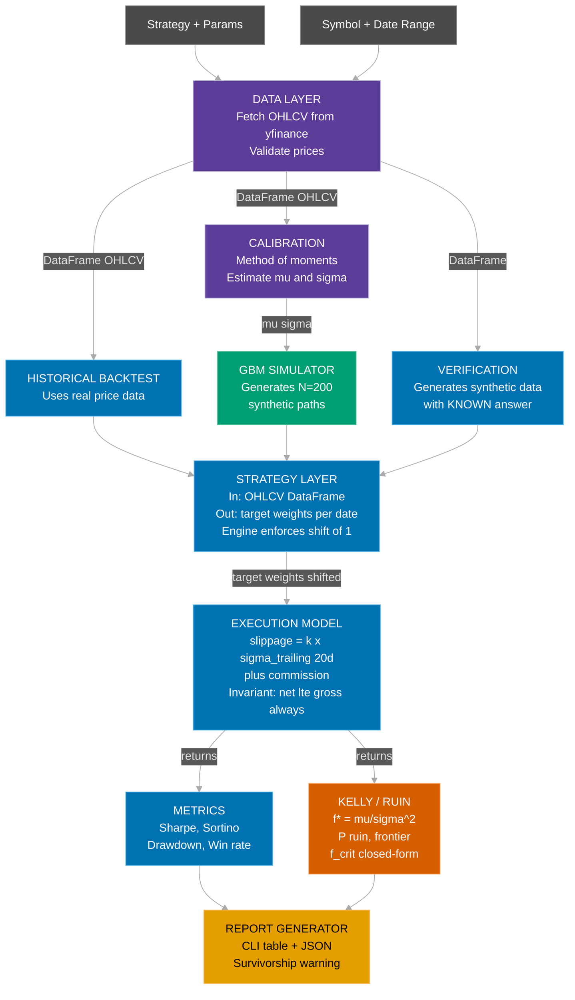

# PRD: Statistical Arbitrage Backtesting System

**Date:** 2026-02-07
**Status:** Draft (v5 — all reviewer warnings addressed, frontier numbers verified)
**VICI Challenge:** Task 1 (Easy) - US Stock Backtesting System (美股回測系統)

---

## Executive Summary

A US stock backtesting system designed for statistical arbitrage strategies, differentiated by **capital allocation intelligence**: not just "what happened historically" but "should you trade this, how much, and under what conditions does it break."

Three pillars:

1. **Engine** — Vectorized backtesting with architectural look-ahead prevention
2. **Kelly/Ruin Analysis** — Critical Kelly fractions for survival-aware position sizing
3. **Monte Carlo Simulation** — Synthetic price paths to map strategy survival envelopes

**MVP note**: The MVP demonstrates the engine architecture and Kelly analysis using a single-asset SMA strategy as proof-of-concept. Statistical arbitrage (pairs trading with cointegration) is the North Star application. The three-pillar architecture, semantic contracts, and mathematical framework are designed for stat arb from day one — the MVP validates the foundation before adding strategy complexity.

### Why This Approach

Most backtesting tools answer: "Your strategy had a Sharpe of 1.4."

This system answers: "Your strategy had a Sharpe of 1.4. At half-Kelly sizing, your ruin probability is 4.2%. The capital efficiency frontier shows you retain 75% of max growth at half the risk. Data source is survivorship-biased — treat results with skepticism."

The North Star extends this to: Deflated Sharpe after multiple trials, signal half-life, factor attribution, and regime-conditional survival analysis.

### Target Reviewer

VICI Holdings (威旭資訊) — a Taiwan-based HFT prop shop. The reviewer will:
- Know that daily-bar backtesting is not HFT infrastructure
- Respect statistical rigor over feature breadth
- Look for awareness of backtesting pitfalls (overfitting, look-ahead, survivorship)
- Value engineering design thinking and code quality

---

## Design Decisions & Trade-offs

These decisions shape the architecture. Reading them first provides context for everything that follows.

### Decision 1: Daily-Bar Statistical Arbitrage Focus

**Context**: VICI is an HFT prop shop. The assignment says "美股回測系統" without specifying frequency.

**Decision**: Focus on daily-bar statistical arbitrage strategies.

**Rationale**:
- An HFT backtester must model the order book as a stochastic process, simulate queue priority (FIFO vs. pro-rata matching, the distinction between resting and taking), account for the fact that limit orders that execute are adversely selected — research shows 81-89% of limit order fills in futures (ES, NQ, CL, ZN) are adverse (arXiv:2409.12721v2), meaning the market moves against the maker immediately after the fill. Naive backtests that assume 100% fill probability at resting price flip the sign of PnL when adverse selection is properly modeled. The system must also replay at microsecond granularity with realistic network topology and model the three distinct latency components (feed, order entry, response). This is a systems engineering problem requiring C++/Rust, co-located Level 2/3 data feeds costing tens of thousands per year, and calibration against live fills. It is not a 7-day Python project
- Building a toy HFT backtester in Python would lack credibility with a firm that runs production systems in C++ with FPGA acceleration (primarily for feed handling and order entry)
- A well-engineered stat arb backtester with genuine statistical rigor demonstrates engineering design thinking at the appropriate abstraction level
- The builder's strength is in statistics, not market microstructure — playing to strength is better engineering judgment than chasing scope

**Trade-off**: Does not directly showcase HFT-relevant infrastructure. Compensated by demonstrating deep awareness of HFT challenges (see Research Foundation) and statistical sophistication that transfers to any strategy class.

### Decision 2: Vectorized Engine with Enforced Shift (not Event-Driven)

**Context**: Event-driven architecture is the "gold standard" for production backtesting.

**Decision**: Vectorized (pandas/numpy) engine with engine-controlled temporal shift.

**Rationale**:
- Vectorized is 100-1000x faster than Python event-driven
- Look-ahead prevention achieved through engine-controlled shift(1) — verified by known-answer tests (AC-2)
- Event-driven plumbing consumes implementation time without improving correctness at daily-bar scale
- Event-driven's primary advantage (structural look-ahead prevention) is replicated via shift(1); its secondary advantage (mirroring live trading) is irrelevant since we are not building a live trading system

**Trade-off**: Cannot extend to tick-level. Documented as architectural boundary.

### Decision 3: Kelly/Ruin as First-Class Feature

**Context**: Most backtesting frameworks stop at Sharpe + drawdown.

**Decision**: Kelly criterion analysis and ruin probability are core features.

**Rationale**:
- The reverse Kelly question ("max safe bet?") is directly actionable
- The capital efficiency frontier communicates risk/reward in ways a single Sharpe cannot
- While the Kelly-ruin relationship is well-established in the literature (Thorp 1962/2006, Vince "Leverage Space Trading Model"), packaging it as a first-class backtester output is genuinely differentiated — no mainstream backtesting framework ships this
- MVP ships closed-form Kelly + ruin (no numerical optimization needed). North Star adds bootstrap CI, non-Gaussian adjustment, and regime-conditional Kelly
- Aligns with the builder's statistical background

**Trade-off**: Time spent on Kelly is time not spent on more strategies. Justified as primary differentiator.

### Decision 4: Monte Carlo Simulation as Dual-Purpose Tool

**Decision**: Simulation serves both strategy stress testing AND engine verification.

**Rationale**: Synthetic data with known parameters provides ground truth for engine verification ("testing the tester"). Additionally, survival envelopes are a novel output.

**Trade-off**: Buggy simulator produces misleading results. Mitigated by moment-matching validation and known-answer tests.

### Decision 5: GBM Only for MVP (Regime-Switching, Heston in North Star)

**Context**: Heston is the "right" stochastic volatility model. Regime-switching is a practical middle ground. GBM is the simplest.

**Decision**: MVP ships GBM only. Regime-switching and Heston are documented in North Star.

**Rationale**:
- GBM with method-of-moments calibration is implementable in a single day
- Even simple GBM serves the dual purpose: stress-test strategy via Monte Carlo AND verify engine via known-answer tests
- Regime-switching (North Star) adds 1-2 days for EM calibration and state management
- Heston adds another 2 days for 5-parameter optimization via characteristic function / FFT — fraught with numerical issues (Feller condition, non-convex optimization, multiple local minima) and depends heavily on options data (implied vol surface) that we do not have
- GBM's limitations (no fat tails, no vol clustering) are explicitly documented (see L9 in Acknowledged Limitations)

**Trade-off**: Simulation underestimates tail risk. Compensated by documenting this prominently and by comparing empirical vs. theoretical ruin to surface model inadequacy.

### Decision 6: Trial Registry Deferred to North Star

**Context**: Lopez de Prado shows that after only 7 trials, expect Sharpe >1 from noise. Trial tracking forces intellectual honesty.

**Decision**: Trial registry and DSR are North Star features, not MVP. The mathematical specification and motivation are documented in this PRD.

**Rationale**: Implementing DSR correctly requires the trial registry (stateful JSON), the V[SR-hat] formula (skewness/kurtosis dependent), and SR_0 computation (expected max under null). This is a self-contained module but adds scope. For a demo, the documented awareness of multiple testing bias is sufficient to demonstrate statistical sophistication.

**Trade-off**: MVP cannot correct for selection bias. Acknowledged in L7.

### Decision 7: Python with pandas/numpy

**Decision**: Python 3.12+, pandas, numpy, scipy.

**Rationale**: Universally readable by quant engineers. At daily-bar scale, performance is sufficient. scipy provides numerical solvers for Kelly/ruin.

**Trade-off**: Cannot handle tick data at scale. Documented as architectural boundary.

---

## System Design

### Semantic Data Flow (MVP)



> **Color legend** (Wong color-blind safe palette): <span style="color:#56B4E9">Blue</span> = Engine pipeline, <span style="color:#D55E00">Orange</span> = Kelly/Ruin, <span style="color:#009E73">Teal</span> = Simulation, <span style="color:#b2abd2">Purple</span> = Data Layer, <span style="color:#E69F00">Gold</span> = Report output, Gray = User inputs

### Key Semantic Contracts Between Components

| Boundary | Semantic | Invariant |
|----------|----------|-----------|
| Data → Strategy | "Here is everything that has happened up to today" | No future data leaks through this interface. DataFrame passed as copy, not view — prevents accidental mutation by strategy code |
| Strategy → Engine | "Here is what I want to hold tomorrow" | Weights are intentions, not executed positions |
| Engine shift(1) | "Yesterday's intention becomes today's execution" | Temporal gap enforced mechanically by engine, not by strategy discipline |
| Engine → Execution Model | "Execute these weight changes at today's prices" | Costs are applied pessimistically; net <= gross always |
| Returns → Kelly Analyzer | "Here is the realized return stream" | Edge and volatility estimated from the SAME returns the strategy produced. Warmup-period bars (zero position) are excluded — only active trading bars contribute to Kelly estimation |
| Verification → Strategy | "Here is synthetic data with a known answer" | Verification data follows the SAME pipeline as historical/simulated data — by design, we test the actual code path, not a mock. The difference is that we know the correct answer and can check the engine's output against it |

---

## Full Feature Vision (North Star)

This section describes the complete product. The MVP assessment version (below) implements a subset. *To skip directly to what ships, see [MVP Assessment Version](#mvp-assessment-version-demo-only).*

### Pillar 1: Backtesting Engine

#### Data Layer
- **Pluggable data sources**: Yahoo Finance, Alpha Vantage, CSV/Parquet files
- **Universe management**: Multi-stock support with dynamic universe membership
- **Adjustment handling**: Split-adjusted, dividend-adjusted prices
- **Data alignment**: Multi-ticker universe alignment strategy (inner join on trading dates, explicit policy for halts, delistings, IPO dates, forward-fill rules for missing bars)
- **Price validation**: Positivity check (log-prices require strictly positive values), NaN detection, >50% gap detection, zero-volume filtering
- **Survivorship awareness**: Document limitations of free data; design interfaces to support survivorship-bias-free sources (CRSP, EDI) in future
- **Survivorship bias quantification**: Run strategies on known-survivor pairs vs. synthetic "delisted pair" scenarios to measure magnitude of the bias
- **Survivorship bias warning**: Standing warning in every report when using yfinance: "Data source: yfinance (survivorship-biased). Results may overstate strategy performance"
- **Point-in-time awareness**: Data interface designed for PIT data even if initial sources are not PIT
- **Caching**: Cache fetched data to local Parquet keyed by ticker + date range; `--no-cache` flag to force refetch
- **Close auction awareness**: Document that trades are assumed to execute at close prices; real closing auctions have participation constraints

#### Strategy Interface
- **Target weights abstraction**: All strategies produce `{symbol: weight}` — the engine handles everything else
- **Built-in strategies**: SMA crossover, momentum (cross-sectional & time-series), mean-reversion, pairs trading (cointegration-based), factor-based (value, momentum, quality)
- **Custom strategies**: Users extend base class, implement `compute_target_weights()`
- **Rebalance scheduling**: Configurable frequency (daily, weekly, monthly, custom)
- **Pairs trading hedge ratio methods**: OLS (baseline), Total Least Squares / Deming regression (unbiased when both series have noise — Vidyamurthy 2004), Johansen procedure (multivariate cointegration)
- **Cointegration testing**: Engle-Granger two-step (ADF on residuals), Johansen trace test (higher power, does not require choosing dependent variable), Phillips-Ouliaris test

#### Execution Model
- **Temporal enforcement**: Engine applies signal shift — strategies cannot cause look-ahead bias in execution path
- **Slippage model**: Proportional to trailing realized volatility and order size; configurable multiplier
- **Square-root impact model**: Impact = sigma * sqrt(Q/V) following Almgren-Chriss [8], verified across 8M institutional trades. Captures the non-linear relationship between order size and market impact
- **Slippage calibration per asset class**: Different default k for large-cap liquid (k~0.05, ~5 bps round-trip), mid-cap (k~0.2), small-cap illiquid (k~1.0). MVP uses single k with documentation of calibration gap
- **Time-varying transaction costs**: Spreads widen in volatile markets (precisely when regime-switching strategies trade most). Model spread cost as a function of realized volatility, not just a fixed parameter
- **Commission model**: Per-share and per-trade, configurable per-exchange
- **Spread cost**: Half-spread per side, derived from historical bid-ask or estimated from volatility
- **Transaction cost attribution**: Decompose gross return into net return + slippage cost + commission cost + spread cost
- **Cost-leverage interaction**: Transaction costs scale with leverage — at high Kelly fractions, rebalancing friction reduces the effective edge. Kelly should be computed from net returns accounting for this interaction
- **Strategy capacity estimation**: Given the square-root impact model, estimate the maximum capital the strategy can absorb before market impact erodes the edge below a threshold (e.g., positive Sharpe). Reports capacity in dollars for a given alpha decay tolerance

#### Performance Metrics
- **Standard**: Sharpe, Sortino, Calmar, max drawdown, drawdown duration, win rate, profit factor, annualized return/volatility
- **Autocorrelation-adjusted Sharpe**: Lo (2002) correction — serial correlation in returns overstates Sharpe significance by up to 2x. Apply Newey-West estimator to Sharpe standard errors
- **Tail risk**: CVaR / Expected Shortfall at 95% and 99% confidence levels. Complements drawdown with a distributional tail measure
- **Return autocorrelation diagnostics**: Report ACF at lags 1-5; flag significant autocorrelation that would invalidate standard Sharpe inference
- **Turnover**: Annual portfolio turnover (sum of absolute weight changes), turnover-adjusted return
- **Signal half-life**: Strategy PnL at shift(0), shift(1), shift(2), ... to quantify how quickly the signal's edge decays with execution delay. Configurable threshold for "rapid decay" warning (default: shift(1) PnL < 50% of shift(0))
- **Factor attribution**: Regress strategy returns against benchmark (SPY) and standard factors to decompose alpha vs. beta exposure
- **Benchmark comparison**: Strategy return vs. buy-and-hold benchmark, with excess return and tracking error
- **Advanced**: Deflated Sharpe Ratio (DSR) with explicit V[SR-hat] formula (Bailey & Lopez de Prado 2014 [1], Eq. 3, accounting for skewness and kurtosis), returns concentration (HHI-inspired), Return on Execution Costs
- **Multiple testing correction**: Bonferroni / Holm correction for familywise error rate when evaluating multiple strategies [3]. Complement to DSR for controlling false discovery
- **Out-of-sample degradation**: Ratio of out-of-sample Sharpe to in-sample Sharpe across walk-forward windows (with explicitly specified stride), reported as a distribution
- **Trial registry**: Every backtest run logged with parameters, metrics, and timestamp — required for DSR computation. Deduplicate by (strategy, parameters, universe, date_range) hash to avoid inflating N from repeated debugging runs

#### Validation
- **Walk-forward validation**: Rolling and anchored window variants with explicit stride specification
- **Combinatorial Purged Cross-Validation (CPCV)**: With purging and embargo periods
- **Bootstrap confidence intervals**: On Sharpe, drawdown, and other key metrics
- **Probability of Backtest Overfitting (PBO)**: Statistical test from logged trial history [2]
- **Structural break tests**: CUSUM, Bai-Perron for non-parametric regime change detection without specifying number of regimes ex ante

### Pillar 2: Kelly Criterion & Ruin Analysis

#### Forward Kelly
- **Full Kelly estimation**: f* = mu/sigma^2 (continuous Gaussian approximation; see Mathematical Specification). Note: this uses arithmetic mean and variance; the approximation holds when returns are small (daily regime). For longer horizons, the arithmetic-geometric return discrepancy matters and should be corrected
- **Gross vs. net return specification**: Kelly must be estimated from net returns (after slippage and commission) to account for friction scaling with leverage. Computing from gross returns overstates the optimal fraction
- **Fractional Kelly**: Half-Kelly, quarter-Kelly with growth rate and ruin tradeoffs. Note: half-Kelly retains 75% of maximum log growth rate, not higher — the growth-variance tradeoff is the reason practitioners prefer it
- **Non-Gaussian adjustment**: Correct Kelly for skewness and kurtosis of actual return distribution
- **Parameter uncertainty**: Bootstrap confidence intervals on f* itself — showing how sensitive the Kelly fraction is to estimation error
- **Cost-leverage interaction**: At higher Kelly fractions, turnover-dependent costs increase. The true Kelly-optimal fraction for a strategy with turnover is lower than mu/sigma^2 because increasing f increases both returns AND costs. Model this interaction explicitly

#### Reverse Kelly (Critical Fraction)
- **Ruin probability curve**: P(hitting drawdown D) as a function of Kelly fraction f (see Mathematical Specification for formula)
- **Domain guard**: At f >= 2f* (zero or negative growth), ruin probability is 1.0 (certain ruin). Solver must detect this boundary and report "no safe fraction exists" rather than producing nonsensical values
- **Critical Kelly solver**: Given max acceptable ruin probability and drawdown threshold, numerically solve for the maximum safe fraction
- **Capital efficiency frontier**: Table showing fraction vs. growth rate vs. ruin probability at multiple drawdown thresholds. Include invariant: ruin probability at f >= 2f* is 1.0

#### Multi-Strategy Kelly
- **Portfolio-level allocation**: Given N strategies with correlated returns, compute optimal allocation vector across strategies
- **Correlation-aware sizing**: Account for diversification benefit when strategies have low correlation

#### Regime-Conditional Kelly
- **Volatility-regime Kelly**: Estimate separate (mu, sigma) for high/low volatility environments
- **Windowed regime analysis**: Rolling-window (mu, sigma) over time with Kelly implications per window — surfaces non-stationarity without requiring an HMM
- **Conditional critical fractions**: Safe bet size per regime
- **Regime detection**: Simple variance-based or Hidden Markov Model

### Pillar 3: Monte Carlo Simulation

#### Price Generation Models
- **Geometric Brownian Motion (GBM)**: Baseline, controlled drift and volatility
- **Regime-Switching (Markov)**: Bull/bear/crisis with distinct (mu, sigma) per state and stochastic transitions
- **GARCH(1,1)**: Volatility clustering
- **Merton Jump Diffusion**: Fat tails, sudden gaps
- **Heston Stochastic Volatility**: Vol-of-vol, leverage effect. Note: calibration requires 5-parameter optimization via characteristic function / FFT, is non-convex with multiple local minima, and benefits from options data (implied vol surface)
- **Correlated Multi-Asset**: Factor model or copula for stat arb pair/portfolio simulation

#### Model Calibration
- **Fit to historical data**: Estimate model parameters from real price series (method of moments for MVP models; MLE or particle filter for advanced models)
- **Parameter perturbation**: Systematically vary parameters to explore sensitivity
- **Random seed management**: Configurable seed for all stochastic processes; deterministic default for reproducibility. Every simulation result must be exactly reproducible given the same seed

#### Strategy Envelope Mapping
- **Monte Carlo backtest**: Run strategy on N simulated paths (e.g., 1,000)
- **Empirical ruin rates**: Compute ruin probability empirically at various Kelly fractions
- **Theory vs. empirical comparison**: Validate theoretical Kelly/ruin against simulated outcomes
- **Survival envelope**: Map strategy viability across parameter space (drift, volatility, correlation, regime)
- **Break-even analysis**: Find the minimum edge required for the strategy to survive at a given Kelly fraction

#### Backtester Verification
- **Known-answer tests**: Generate synthetic data where optimal answer is analytically computable; verify engine correctness
- **Sensitivity diagnostics**: Plot performance surface across parameter perturbations; flag jagged surfaces as overfitting indicators

### Output & Reporting
- **CLI table output**: Human-readable formatted tables for terminal display
- **JSON results**: Machine-readable output for all metrics, Kelly analysis, simulation results
- **Equity curve**: Portfolio value over time with drawdown overlay
- **Validation report**: DSR, walk-forward degradation distribution, confidence intervals
- **Kelly report**: Capital efficiency frontier, critical fractions, survival envelope
- **Data provenance**: Every report header includes data source, date range, ticker universe, and data quality summary (missing bars, forward-filled days, adjusted/unadjusted)
- **Survivorship bias warning**: Prominent per-report warning when using yfinance or other survivorship-biased sources: "Data source: yfinance (survivorship-biased). Results may overstate strategy performance." Cannot be suppressed — forces intellectual honesty
- **Reproducibility metadata**: Every report includes git commit hash (if available), random seed, dependency versions, and CLI invocation string for exact reproduction
- **Warnings**: Automatic flags for suspicious Sharpe (>3), outlier dependence, wide Kelly CI, high turnover, beta-dominated "alpha", strategy break conditions, rapid signal decay, cost-dominated returns (net < 50% of gross)

---

## MVP Assessment Version (Demo-Only)

### Scope Philosophy

**Simplest possible implementation that proves the architecture works.** The MVP is a demo: one strategy, one data source, closed-form math only. No bootstrap, no regime-switching, no walk-forward. Every pillar is present, but at its simplest viable form. The North Star above documents where each component goes next.

The MVP does not implement statistical arbitrage directly — it uses a single-asset SMA strategy to validate the engine, execution model, and Kelly framework. The architecture (target weights abstraction, shift(1) enforcement, pluggable strategy base class) is designed so that adding pairs trading requires only a new strategy subclass, not engine changes. This is a deliberate architectural choice: interfaces are designed for multi-asset from day one, but MVP exercises them with a single asset.

### Non-Goals (MVP)

The following are explicitly out of scope for the MVP. Each is a deliberate decision, not an oversight:

- **Not HFT**: No tick data, no order book, no latency modeling (see Decision 1)
- **Not event-driven**: No event loop, no tick-by-tick processing (see Decision 2)
- **Not multi-asset**: Single stock at a time, no portfolio optimization (see L2, L11)
- **Not pairs trading**: SMA only — stat arb is the North Star application (see L2)
- **Not live trading**: No broker integration, no order execution, no real-time feeds
- **Not production data infrastructure**: No caching, no PIT data, no data vendor integrations (see L1, L13)

### What's In

#### Engine (Pillar 1 — Single Strategy Demo)
- **Data**: Yahoo Finance only (yfinance). Uses adjusted close prices (split- and dividend-adjusted) by default. Single data source, no pluggable interface yet
- **Universe**: 1 stock at a time (single-asset SMA strategy)
- **Strategy**: 1 built-in (SMA crossover). Custom strategy via base class for extensibility proof
- **Execution**: Vectorized engine with enforced shift(1). Slippage = k * trailing volatility (see Slippage Model in Mathematical Specification). Flat commission (default: $0.001/share)
- **Warmup handling**: The first N_slow bars produce no signal (insufficient data for slow MA). Engine skips warmup bars and begins execution on the first bar with a valid signal. The initial position change (from 0 to first target weight) is treated as a trade and incurs slippage and commission
- **Data validation**: NaN check, positive price check. Errors on invalid data rather than producing silent garbage
- **Metrics**: Sharpe, Sortino (downside deviation uses MAR=0, computed over all returns not just negative ones), max drawdown, annualized return, annualized volatility, win rate
- **Survivorship warning**: Every report includes: "Data source: yfinance (survivorship-biased)"

#### Kelly/Ruin (Pillar 2 — Closed-Form Only)
- **Forward Kelly**: f* = mu/sigma^2 from realized return series (post-warmup bars only — warmup-period zero-position bars are excluded from estimation). Full and half-Kelly growth rates
- **Reverse Kelly**: Critical Kelly solver — closed-form (see Mathematical Specification). No numerical optimization needed
- **Capital efficiency frontier**: Table at 0.25f*, 0.50f*, 0.75f*, 1.00f*, 1.50f*, 2.00f* showing growth rate and ruin probability at one drawdown level

#### Simulation (Pillar 3 — GBM + Verification Only)
- **Model**: GBM only (no regime-switching in MVP)
- **Calibration**: Method of moments on historical daily log-returns — estimate mu (annualized drift) and sigma (annualized volatility)
- **Monte Carlo backtest**: Run strategy on N=200 simulated GBM paths
- **Point ruin comparison**: Compare empirical ruin rate at half-Kelly vs. theoretical prediction
- **Known-answer verification**: Synthetic data where correct answer is analytically known

#### CLI

The binary is named `backtest` (installed via pyproject.toml entry point). Three subcommands:

- `backtest run` — Run SMA strategy on historical data, output metrics + Kelly analysis
- `backtest simulate` — Run strategy on GBM-simulated data, compare empirical vs. theoretical ruin
- `backtest verify` — Run known-answer tests to verify engine correctness

Default output is CLI table to stdout. `--json` flag outputs JSON to stdout instead. Both formats contain identical data

### Built-in Strategy Specification

#### SMA Crossover
- **Signal**: fast_MA(close, N_fast) > slow_MA(close, N_slow) then long; else flat
- **Parameters**: N_fast (default: 20), N_slow (default: 50)
- **Weights**: `{symbol: 1.0}` when long, `{symbol: 0.0}` when flat
- **Single-asset**: Operates on one symbol at a time

### Acceptance Criteria

#### Engine

**AC-1: Historical backtest produces correct returns**
- Given: synthetic price series where stock rises 1% every day for 10 days
- When: run with a strategy that is always long with weight 1.0, zero slippage, zero commission
- Then: total return equals (1.01^10 - 1) = 10.46% within floating-point tolerance (1e-10)

**AC-2: Look-ahead prevention verified**
- Given: a "perfect foresight" strategy that returns weight=1.0 on days before price increases, weight=0.0 otherwise
- When: engine applies shift(1) and runs backtest
- Then: returns are consistent with 1-day-delayed execution, NOT same-day. Strategy return is strictly less than sum of all positive daily returns

**AC-3: Slippage reduces returns**
- Given: any strategy run with slippage > 0
- Then: net returns < gross returns for every rebalance period. Invariant: slippage NEVER increases returns

#### Kelly/Ruin

**AC-4: Kelly fraction matches analytical solution**
- Given: a deterministic return series constructed with exactly mu = 0.05%/day and sigma = 1.0%/day (e.g., alternating returns that produce these exact moments)
- Then: estimated f* = mu/sigma^2 = 5.0 within floating-point tolerance (1e-6)
- Note: this tests the computation path, not estimation from noisy data. The inputs have known exact moments

**AC-5: Capital efficiency frontier is internally consistent**
- Given: any completed Kelly analysis
- Then: growth rate at f=0 is 0, at f* is maximum, at 2f* is 0, at f > 2f* is negative. Ruin probability is monotonically increasing in f. Mathematical invariants — violations indicate a bug

#### Simulation

**AC-6: GBM moment matching**
- Given: GBM with drift parameter mu=0.10/year, volatility parameter sigma=0.20/year, 200 paths of 252 days each
- Then: mean of simulated log-returns matches the theoretical mean (mu - sigma^2/2)*T within 2 standard errors; sample standard deviation of log-returns matches sigma*sqrt(T) within 2 standard errors
- Note: mu here is the GBM drift parameter, not the expected arithmetic return. The distinction matters: E[S_T/S_0] = exp(mu*T), but E[log(S_T/S_0)] = (mu - sigma^2/2)*T
- **Determinism note**: With 200 paths and 2-SE tolerance, there is an expected ~5% false failure rate from sampling noise. For CI/automated tests, use a fixed default seed (e.g., seed=42) to ensure deterministic pass/fail. For ad-hoc runs, re-run once before investigating failures

**AC-7: Known-answer verification passes**
- Given: synthetic GBM data with mu=0, sigma=0.20 (zero-edge), fixed seed
- When: any strategy runs
- Then: expected Sharpe within 2 standard errors of zero. Engine does not create phantom returns
- **Determinism note**: Same fixed-seed policy as AC-6

### Acknowledged MVP Limitations

These are known trade-offs accepted for the demo version. Each maps to a specific North Star capability.

| # | Limitation | Impact | North Star Resolution |
|---|-----------|--------|----------------------|
| L1 | Single data source (yfinance) — survivorship-biased, not point-in-time | Results overstate strategy performance | Pluggable data interface supporting CRSP, Parquet, CSV |
| L2 | No pairs trading — SMA only | Cannot demo stat arb directly | Pairs trading with cointegration, hedge ratio methods (OLS, TLS, Johansen) |
| L3 | No bootstrap CI on Kelly | Cannot quantify f* estimation uncertainty | Bootstrap CI (1,000 resamples) showing how sensitive Kelly is to mu estimation error |
| L4 | No walk-forward validation | Cannot detect overfitting or OOS degradation | Rolling/anchored walk-forward with OOS degradation ratio |
| L5 | No regime-switching simulation | Cannot stress-test strategy across market regimes | 2-state Markov with EM calibration, regime-conditional Kelly |
| L6 | No signal half-life or factor attribution | Cannot assess execution speed sensitivity or alpha vs. beta | Signal decay at shift(0..3), SPY regression for alpha/beta/R^2 |
| L7 | No DSR or trial registry | Cannot correct for multiple testing bias | Append-only trial log, DSR with V[SR-hat] (Bailey & Lopez de Prado 2014) |
| L8 | No turnover reporting | Cannot assess friction drag at scale | Annualized turnover + turnover-adjusted return |
| L9 | GBM only (no fat tails, no vol clustering) | Simulation underestimates tail risk | Regime-switching, GARCH, Heston, Merton Jump Diffusion |
| L10 | Slippage = k * sigma only (no order-size impact) | Underestimates costs for large positions | Square-root impact model (Almgren-Chriss), per-asset-class calibration |
| L11 | No multi-strategy Kelly | Cannot optimize across correlated strategies | Portfolio-level Kelly with correlation-aware sizing |
| L12 | No structural break detection | Cannot detect regime changes in historical data | CUSUM, Bai-Perron non-parametric tests |
| L13 | No data caching | Repeated runs re-fetch from yfinance (slow, rate-limit risk) | Local Parquet cache keyed by ticker + date range |
| L14 | Minimal data validation (NaN + positivity only) | May miss subtle data issues (splits, gaps, zero volume) | Full validation suite: >50% gap detection, zero-volume filtering, adjustment verification |

---

## Success Criteria

### For VICI Assessment

1. All 7 acceptance criteria (AC-1 through AC-7) pass
2. `backtest run` produces a complete report on real US stock data
3. `backtest simulate` runs strategy on GBM-simulated data with ruin comparison
4. `backtest verify` passes all known-answer tests
5. Code is clean, well-tested, type-checked, linted
6. Design decisions and Acknowledged MVP Limitations demonstrate engineering thinking

### What "Done" Looks Like

*Note: numbers below are illustrative output format only. Actual values depend on market data and strategy parameters.*

```
$ backtest run --strategy sma --symbol AAPL --start 2019-01-01 --end 2024-01-01

WARNING: Data source: yfinance (survivorship-biased). Results may overstate performance.

── Historical Performance ──
Sharpe: 0.82 | Sortino: 1.14 | Annual Return: 11.3%
Max Drawdown: -18.7% (duration: 62 days)
Annualized Vol: 13.8% | Win Rate: 48.1%
Gross Return: 12.9% | Net Return: 11.3% | Cost Drag: 1.6%

── Kelly Analysis ──
Estimated edge (mu): 0.045%/day | Volatility (sigma): 0.87%/day
Full Kelly (f*): 5.9x | Half Kelly: 2.95x
Critical Kelly (1% ruin, 50% DD): 0.42x

── Capital Efficiency Frontier (50% drawdown) ──
Fraction  | Growth (% of max) | P(ruin)
0.25 f*   |      43.8%        |   0.8%
0.50 f*   |      75.0%        |  12.5%
0.75 f*   |      93.8%        |  31.5%
1.00 f*   |     100.0%        |  50.0%
1.50 f*   |      75.0%        |  79.4%   ← same growth as half-Kelly, much higher ruin
2.00 f*   |       0.0%        | 100.0%   ← zero growth, certain ruin

  Formula: P(ruin) = D^(2/alpha - 1) where alpha = f/f*, D = drawdown level
  At half-Kelly (alpha=0.5): P = 0.50^3 = 12.5%

$ backtest simulate --strategy sma --symbol AAPL --paths 200

── Simulation Results (200 GBM paths, 50% drawdown) ──
Empirical ruin rate at half-Kelly: 13.8% (theoretical: 12.5%)
  NOTE: GBM assumes no fat tails. Real ruin risk likely higher.

$ backtest verify

── Known-Answer Tests ──
AC-1 (correct returns):      PASS  (expected: 10.462%, got: 10.462%)
AC-2 (look-ahead prevention): PASS  (foresight return < theoretical max)
AC-3 (slippage invariant):   PASS  (net < gross for all periods)
AC-4 (Kelly analytical):     PASS  (f*=5.0, expected: 5.0, tol: 1e-6)
AC-5 (frontier consistency): PASS  (monotonic ruin, g(2f*)=0)
AC-6 (GBM moments):          PASS  (log-return mean within 2 SE, sigma within 2 SE)
AC-7 (zero-edge Sharpe):     PASS  (Sharpe=0.04, within 2 SE of 0)
```

---

## Mathematical Specification

### Volatility Convention

All volatility references in this document use the same convention:

```
sigma_daily = std(daily log-returns)    # NOT annualized
sigma_annual = sigma_daily * sqrt(252)  # annualized for reporting only
```

Specifically:
- **Slippage model**: uses sigma_daily (trailing 20-day)
- **Kelly estimation**: uses mu_daily and sigma_daily from the realized return series
- **GBM calibration**: uses annualized mu and sigma (converted from daily via sqrt(252) scaling)

Log-returns are used throughout: r_t = ln(P_t / P_{t-1}). This is consistent with the continuous-time Kelly framework and ensures additivity of returns across time.

### Kelly Criterion (Continuous Gaussian Approximation)

We use the continuous-time Gaussian approximation throughout. This assumes log-normal returns and continuous rebalancing. It is adequate for daily-bar strategies with diversified portfolios; it breaks down for highly skewed strategies or concentrated bets. More precisely, the Kelly criterion maximizes E[log(1 + f*r)], which for small r approximates to f*mu - f^2*sigma^2/2 via Taylor expansion.

**Growth rate as a function of Kelly fraction f:**

```
g(f) = mu*f - (sigma^2 * f^2) / 2
```

where mu = expected daily return, sigma = daily return standard deviation.

**Optimal (full Kelly) fraction:**

```
f* = mu / sigma^2
```

**Growth rate at key fractions:**

| Fraction | Growth Rate (as % of max) |
|----------|--------------------------|
| 0.25 f* | 43.75% |
| 0.50 f* | 75.00% |
| 0.75 f* | 93.75% |
| 1.00 f* | 100.00% |
| 1.50 f* | 75.00% (same as half-Kelly!) |
| 2.00 f* | 0.00% (zero growth) |

Note: half-Kelly retains **75%** of maximum log growth rate, NOT 94%. The commonly cited "94% of return" figure conflates expected arithmetic return with log growth rate. We use log growth rate because it governs long-run compounding and ruin probability. The tradeoff is real: half-Kelly sacrifices 25% of max growth rate in exchange for dramatically lower variance and ruin probability.

Derivation: g(f*/2) = mu(f*/2) - sigma^2(f*/2)^2/2 = mu^2/(2*sigma^2) - mu^2/(8*sigma^2) = 3*mu^2/(8*sigma^2) = 0.75 * mu^2/(2*sigma^2) = 0.75 * g(f*).

### Ruin Probability

For a strategy with growth rate g(f) and portfolio volatility sigma_p = sigma*f, the probability of hitting drawdown D (as a fraction, e.g., 0.50 for 50%) before hitting any target profit level is approximately:

```
P(ruin | f, D) = D^(2*g(f) / (sigma^2 * f^2))
```

where the exponent simplifies to:

```
2*g(f) / (sigma^2 * f^2) = 2*(mu*f - sigma^2*f^2/2) / (sigma^2*f^2) = 2*mu/(sigma^2*f) - 1
```

This is the continuous-time approximation for geometric Brownian motion returns. It is derived from the hitting probability of a Brownian motion with drift (see Karatzas & Shreve [7], Theorem 3.5.4, or Thorp [4]). The formula assumes continuous rebalancing and no margin calls; at daily rebalancing frequency, it is an approximation. Discrete rebalancing introduces path-dependence not captured by the formula, but the error is small at daily scale.

**Critical Kelly solver**: given target ruin probability P_target and drawdown level D, solve for f:

```
P_target = D^(2*mu/(sigma^2*f) - 1)

ln(P_target) = (2*mu/(sigma^2*f) - 1) * ln(D)

f_critical = 2*mu / (sigma^2 * (ln(P_target)/ln(D) + 1))
```

This has a closed-form solution. We verify the solution by plugging f_critical back into the ruin formula and checking P(ruin | f_critical, D) = P_target.

**Validity check**: if f_critical >= 2*f*, the requested ruin tolerance cannot be achieved — report "no safe fraction exists at the given drawdown level" rather than returning a meaningless value. This connects to the domain guard described in the North Star Kelly section (at f >= 2f*, ruin is certain).

### Deflated Sharpe Ratio (North Star — not in MVP)

Following Bailey & Lopez de Prado (2014) [1]. Documented here for completeness and to demonstrate awareness of multiple testing bias (see L7 in Acknowledged Limitations):

```
DSR = P[ SR-hat > 0 | SR-hat_0 ]
```

where SR-hat_0 is the expected maximum Sharpe ratio under the null hypothesis of N independent trials:

```
SR-hat_0 = sqrt(V[SR-hat]) * ((1 - gamma) * inv_norm(1 - 1/N) + gamma * inv_norm(1 - 1/(N*e)))
```

where N = number of trials from the trial registry, gamma = 0.5772 (Euler-Mascheroni constant), V[SR-hat] is the variance of the Sharpe ratio estimator (which depends on skewness and kurtosis of returns), and inv_norm is the inverse normal CDF.

**Trial counting rule**: every invocation of `backtest run` counts as one trial, regardless of whether the strategy or parameters changed. This is conservative — it overestimates the number of trials rather than underestimating. The trial registry stores: timestamp, strategy name, strategy parameters, universe, date range, all computed metrics.

### Slippage Model (MVP)

```
slippage_per_side = k * sigma_trailing(20)
```

where k is the slippage multiplier (default: 0.5) and sigma_trailing(20) is the standard deviation of the most recent 20 daily log-returns (NOT annualized). Applied to each side of a trade (buy and sell).

This is a simplification — the full model would include order size via the square-root law (Impact proportional to sigma * sqrt(Q/V)). At MVP portfolio sizes with daily-bar data, the order-size component is negligible. The interface accepts a configurable k to allow pessimistic testing (e.g., k=2.0 to simulate 4x normal slippage).

---

## System Inputs & Outputs (MVP)

### User-Provided Inputs

| Input | Description | Default | Example |
|-------|-------------|---------|---------|
| **Strategy** | Which strategy + parameters | `sma` | `sma --fast 20 --slow 50` |
| **Symbol** | A US stock ticker | (required) | `AAPL` |
| **Date range** | Historical period | Last 5 years | `--start 2019-01-01 --end 2024-01-01` |
| **Commission** | Per-share commission | $0.001 | `--commission 0.005` |
| **Slippage multiplier** | k in slippage = k * trailing vol | 0.5 | `--slippage-k 1.0` |
| **Ruin threshold** | Max acceptable ruin probability | 0.01 (1%) | `--ruin-threshold 0.05` |
| **Drawdown level** | Drawdown threshold for ruin | 0.50 (50%) | `--drawdown-level 0.25` |
| **Simulation paths** | Number of Monte Carlo paths | 200 | `--paths 500` |

### Data Inputs (System-Fetched)

| Data | Format | Source | Granularity |
|------|--------|--------|-------------|
| **OHLCV price bars** | DataFrame: date, open, high, low, close, volume | Yahoo Finance (yfinance) | Daily |

### Outputs

| Output | Description | Consumer |
|--------|-------------|----------|
| **Backtest report** | Sharpe, Sortino, max drawdown, return, vol, win rate + Kelly analysis | Quant researcher |
| **Simulation report** | Empirical ruin rate at half-Kelly vs. theoretical prediction | Quant researcher |
| **Verification report** | Known-answer test results (pass/fail with expected vs. actual) | Developer / auditor |
| **JSON export** | Machine-readable version of all reports | Downstream tools |
| **Survivorship warning** | Prominent data source caveat on every report | All consumers |

---

## Timeline & Prioritization

### Day-by-Day Plan

| Day | Focus | Deliverable |
|-----|-------|------------|
| **Day 1** | Project scaffolding + Data layer | pyproject.toml, CLI skeleton, yfinance data loader with validation. Data layer tests pass |
| **Day 2** | Engine core + Execution model | Vectorized engine with shift(1), slippage model, commission. AC-1, AC-2, AC-3 pass |
| **Day 3** | SMA strategy + Metrics | SMA crossover strategy. Sharpe, Sortino, max drawdown, return/vol, win rate. End-to-end `backtest run` works |
| **Day 4** | Kelly/Ruin analyzer | Forward Kelly, reverse Kelly solver (closed-form), capital efficiency frontier. AC-4, AC-5 pass |
| **Day 5** | GBM Simulation + Verification | GBM path generation, Monte Carlo backtest loop, empirical ruin comparison, known-answer tests. AC-6, AC-7 pass |
| **Day 6** | Integration + Polish | CLI integration (`run`, `simulate`, `verify`), report formatting (CLI tables + JSON), survivorship warning, JSON export |
| **Day 7** | Buffer + Documentation | README, run full demo on real data (AAPL), fix bugs. Final verification of all 7 ACs. If ahead of schedule: add bootstrap CI on Kelly (L3) as highest-value North Star feature |

### Priority Order (if forced to cut)

1. **Must ship**: Engine (AC-1, AC-2, AC-3) + SMA strategy + basic metrics + Kelly analyzer (AC-4, AC-5)
2. **Should ship**: GBM simulation (AC-6) + known-answer verification (AC-7) + JSON export
3. **Nice to have**: Polished CLI formatting, comprehensive error messages

### Minimum Shippable Product (absolute floor)

Engine with SMA strategy + Kelly closed-form analysis. No simulation. This still demonstrates: correct engine, statistical rigor (Kelly), and engineering discipline (shift(1) verification).

---

## Risks & Failure Modes

### Risk 1: Kelly Estimation Sensitivity (Severity: HIGH)

**The problem**: Kelly fraction f* = mu/sigma^2 is extremely sensitive to mu estimation. A factor-of-two error in mu (well within normal estimation uncertainty for daily returns) doubles f*, potentially catastrophic.

**Example**: If true mu = 0.03%/day and sigma = 1.0%/day, then f* = 3.0x. If mu estimated as 0.06%/day, f* = 6.0x — double leverage.

**MVP mitigation**: Capital efficiency frontier showing ruin at each fraction. Monte Carlo empirical ruin check at half-Kelly. Prominent warning that point estimate of f* is unreliable without confidence intervals.

**North Star mitigation**: Bootstrap CI on f* (1,000 resamples), warning when CI is wide.

**Residual risk**: Users may anchor on point estimate. MVP lacks bootstrap CI (see L3 in Acknowledged Limitations).

### Risk 2: Vectorized Look-Ahead Bug (Severity: HIGH)

**The problem**: Relies on engine correctly applying shift(1). A bug silently corrupts all results — and makes them look good.

**Mitigation**: Known-answer tests (AC-2: perfect foresight test), shift applied in ONE place (single point to audit), edge-case tests for first/last bars and NaN handling.

**Residual risk**: Subtle edge cases at series boundaries. Mitigated by comprehensive test suite.

### Risk 3: Simulation Model Misspecification (Severity: MEDIUM)

**The problem**: MVP uses GBM only — no fat tails, no vol clustering, no regime changes.

**MVP mitigation**: Explicitly document model assumptions, compare empirical vs theoretical ruin rates, present results as "under GBM assumptions" not "in reality". Note in output that GBM underestimates tail risk.

**North Star mitigation**: Regime-switching, GARCH, Heston, Merton Jump Diffusion.

**Residual risk**: False confidence from simulation. Mitigated by clear labeling (see L9 in Acknowledged Limitations).

### Risk 4: Scope Overrun (Severity: MEDIUM)

**The problem**: Three pillars in 7 days, even at demo scope.

**Mitigation**: MVP is already aggressively trimmed: 1 strategy (SMA), 1 data source (yfinance), closed-form Kelly only, GBM only. See Timeline above. Priority: Engine → Kelly → Simulation.

**Minimum shippable product** (if everything goes wrong): Engine with SMA strategy + Kelly closed-form analysis. No simulation. This still demonstrates correct engine + statistical rigor.

### Risk 5: Data Quality (Severity: MEDIUM)

**The problem**: Yahoo Finance has known issues (missing data, unadjusted splits, rate limiting).

**Mitigation**: Data validation (NaN check, positive price check), survivorship warning in output. MVP validation is minimal (see L14) — sufficient for demo but not production.

### Risk 6: Kelly Assumes Ergodicity and Stationarity (Severity: MEDIUM)

**The problem**: Kelly assumes infinite repetition and constant (mu, sigma). Neither holds.

**MVP mitigation**: Fractional Kelly (half-Kelly retains 75% of max growth — substantial buffer). GBM simulation provides empirical ruin check. Capital efficiency frontier shows consequences of over-betting.

**North Star mitigation**: Walk-forward detects (mu, sigma) instability. Regime-conditional Kelly adjusts for non-stationarity. Structural break tests (CUSUM, Bai-Perron) flag regime changes.

### Error Handling Requirements

| Scenario | Behavior |
|----------|----------|
| yfinance returns no data for ticker | Error: "No data for ticker X. Check symbol and date range" |
| Date range has no trading days | Error: "No trading days in range" |
| Strategy produces NaN weights | Error: "Strategy produced NaN weights on date X. Check strategy logic or data quality" |
| Kelly estimation gives f* < 0 (negative edge) | Report: "Strategy has negative expected return. Kelly fraction is undefined. Do not trade" |
| Simulation produces NaN/Inf (bad parameters) | Error: "Simulation produced invalid values. Check model parameters" |
| Insufficient data for estimation (< 30 bars) | Error: "Insufficient data for reliable estimation. Need at least 30 trading days" |

### Non-Functional Requirements

| Requirement | Target |
|-------------|--------|
| Single historical backtest (1 stock, 5 years) | < 2 seconds |
| Monte Carlo simulation (200 paths, 1 strategy, 5 years) | < 1 minute |
| Memory usage | < 500 MB |
| All known-answer tests | < 30 seconds total |

---

## Technical Stack

| Component | Choice | Version Constraint | Rationale |
|-----------|--------|-------------------|-----------|
| Language | Python | >=3.12 | Ecosystem, readability |
| Package manager | uv | latest | Monorepo consistency |
| CLI framework | Typer | >=0.9 | Monorepo consistency |
| Data manipulation | pandas + numpy | pandas>=2.0, numpy>=1.26 | Industry standard |
| Statistical computation | scipy | >=1.12 | Optimization, distributions |
| Data fetching | yfinance | >=0.2.36 | Free daily bars |
| Testing | pytest | >=8.0 | Standard |
| Linting | ruff | latest | Fast, comprehensive |
| Type checking | pyright | latest | Correctness |

All dependencies pinned in `pyproject.toml` with `uv.lock` for exact reproducibility.

---

## References

1. Bailey, D.H. & Lopez de Prado, M. (2014). "The Deflated Sharpe Ratio: Correcting for Selection Bias, Backtest Overfitting, and Non-Normality." *Journal of Portfolio Management*, 40(5), 94-107. [SSRN 2460551](https://papers.ssrn.com/sol3/papers.cfm?abstract_id=2460551)

2. Bailey, D.H., Borwein, J.M., Lopez de Prado, M. & Zhu, Q.J. (2014). "Pseudo-Mathematics and Financial Charlatanism: The Effects of Backtest Overfitting on Out-of-Sample Performance." *Notices of the AMS*, 61(5), 458-471. [SSRN 2308659](https://papers.ssrn.com/sol3/papers.cfm?abstract_id=2308659)

3. Harvey, C.R., Liu, Y. & Zhu, H. (2016). "...and the Cross-Section of Expected Returns." *Review of Financial Studies*, 29(1), 5-68. [SSRN 2249314](https://papers.ssrn.com/sol3/papers.cfm?abstract_id=2249314)

4. Thorp, E.O. (2006). "The Kelly Criterion in Blackjack, Sports Betting, and the Stock Market." In *Handbook of Asset and Liability Management*, Volume 1, Chapter 9.

5. Maier-Paape, S. (2015). "Correctness of Backtest Engines." [arXiv:1509.08248](https://arxiv.org/abs/1509.08248)

6. Lopez de Prado, M. (2018). *Advances in Financial Machine Learning*. Wiley. (Chapters on CPCV, PBO, and backtesting methodology)

7. Karatzas, I. & Shreve, S.E. (1991). *Brownian Motion and Stochastic Calculus*, 2nd ed. Springer. Theorem 3.5.4 (hitting probabilities).

8. Almgren, R. & Chriss, N. (2001). "Optimal Execution of Portfolio Transactions." *Journal of Risk*, 3(2), 5-39.

---

## Research Foundation

This PRD is informed by extensive research across:

- **Backtest overfitting**: Lopez de Prado [1,2,6], Harvey/Liu/Zhu [3], White's Reality Check (7,846 trading rules, almost all spurious)
- **Practitioner failures**: Tucker Balch/Quantopian (Sharpe 7.0 in-sample, flat in production from market impact), Ernest Chan (specific look-ahead bugs: using day's high/low for open-day signals), QuantConnect forums ("slippage model should be the first lines of code you write")
- **HFT context**: Adverse selection in fills (81-89% adverse fill rates in futures, arXiv:2409.12721v2), queue position modeling (3 model classes with materially different Sharpe ratios on identical data), latency simulation (3 distinct components: feed, order entry, response). Documented as out-of-scope with rationale in Decision 1
- **Real-world events**: August 2007 Quant Quake (crowded trade unwinds — Renaissance -8.7%, Goldman GEO -30% in one week), Summer 2025 Quant Unwind (cross-sectional leadership flip), Knight Capital ($440M in 45 min from dead code reuse), LTCM ($4.6B loss from 5-year VaR window missing the 1987 crash)
- **Backtester correctness**: Maier-Paape [5] — formal verification of backtest engines; "several platforms are struggling on correctness"
- **Market impact**: Almgren-Chriss [8], square-root law verified across 8M institutional trades

---

## Next Steps

Development workflow (AI-assisted via Claude Code):

1. **Specify** — Formal specification with interface contracts
2. **Design** — Module architecture, data flow, dependency graph
3. **Plan** — Implementation sequencing
4. **Task breakdown** — Granular task list with dependencies
5. **Implement** — Build, test, iterate
