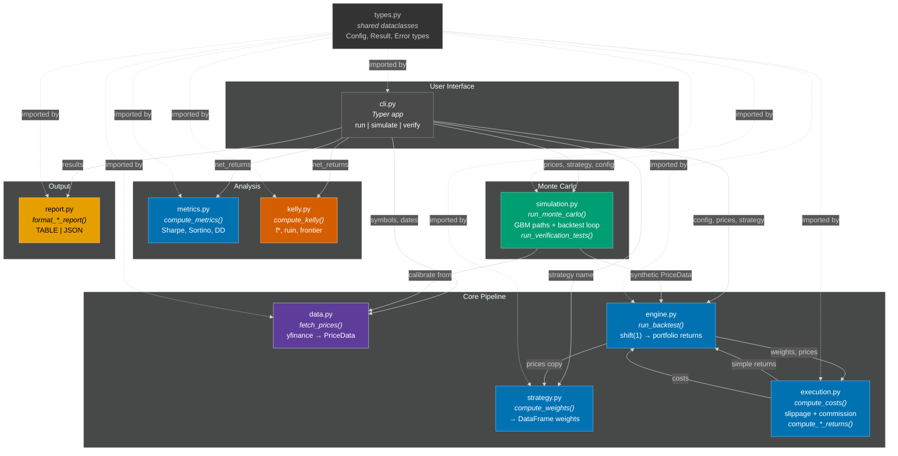
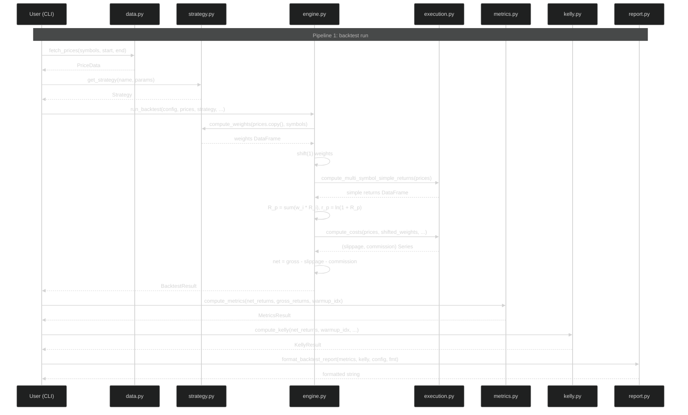
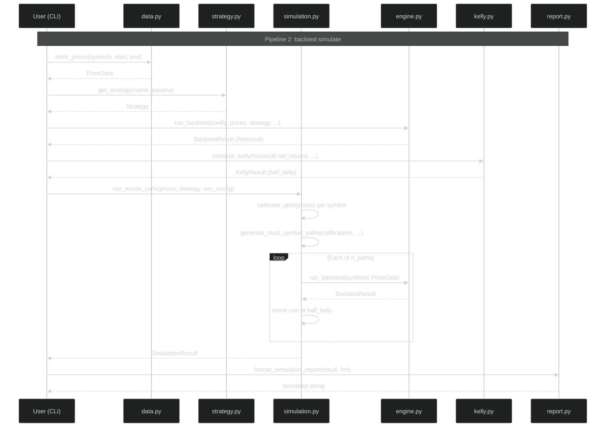
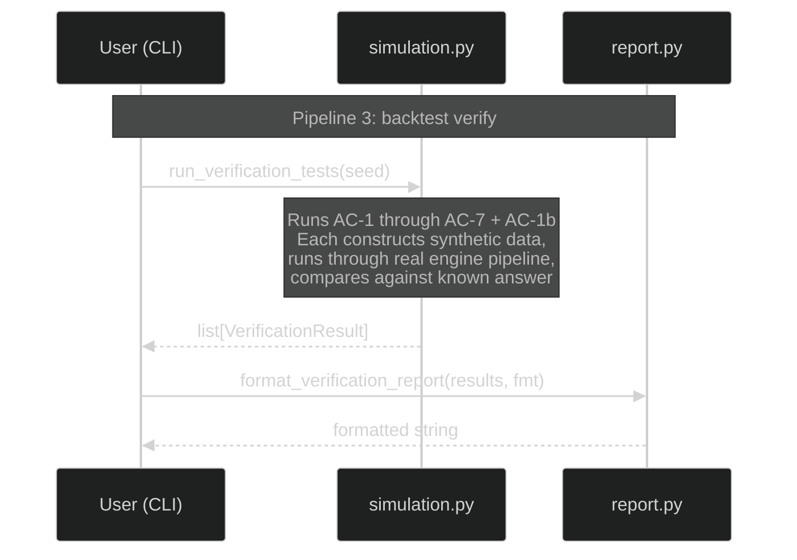
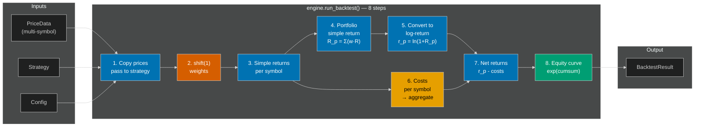

# Design: Statistical Arbitrage Backtesting System

**Feature:** 001-stat-arb-backtester
**Spec Version:** v4
**Design Version:** v1

---

## Prior Art Research

### Codebase Patterns (sibling project: subterminator)

| Pattern | Source | Adoption |
|---------|--------|----------|
| `src/` layout with `pyproject.toml` | `subterminator/pyproject.toml` | Adopt: `src/stock_backtester/` with `[tool.setuptools.packages.find] where = ["src"]` |
| Typer CLI with `app = typer.Typer()` | `subterminator/cli/main.py` | Adopt: `cli.py` as single module (no subpackage — only 3 commands) |
| Shared types module | `subterminator/mcp_orchestrator/types.py` | Adopt: `types.py` at package root, imported by all modules |
| Custom exceptions per domain | `subterminator/utils/exceptions.py`, `subterminator/mcp_orchestrator/exceptions.py` | Depart: sibling centralizes exceptions; we co-locate in domain modules (`DataError` in `data.py`, etc.) for proximity to raise sites |
| pytest + ruff + type checker | `subterminator/pyproject.toml` (uses mypy) | Adopt pytest + ruff; Depart: use pyright instead of mypy (stricter inference, better IDE integration) |

### External Patterns

| Pattern | Source | Adoption |
|---------|--------|----------|
| Layered pipeline (data → returns → weights → costs → portfolio) | VectorBT architecture | Adopt: `engine.py` orchestrates this exact pipeline |
| Vectorized returns via `pct_change()` / `np.log()` | pandas/numpy idiom | Adopt: `execution.py` provides `compute_simple_returns`, `compute_log_returns` |
| Strategy as weight-producing function | Zipline, bt, VectorBT | Adopt: `Strategy.compute_weights()` returns DataFrame of weights |
| Frozen dataclasses for result types | Python dataclasses best practice | Adopt: all result types are `@dataclass(frozen=True)` with `.copy()` at boundaries |
| Kelly as f* = mu/sigma^2 (continuous Gaussian) | Thorp 2006, standard quant finance | Adopt: closed-form in `kelly.py` |
| GBM with Ito correction | Standard quantitative finance | Adopt: `S_{t+1} = S_t * exp((mu - sigma^2/2)*dt + sigma*sqrt(dt)*Z)` |
| Method-of-moments calibration | Simple, unbiased for GBM | Adopt: `calibrate_gbm()` in `simulation.py` |

---

## 1. Architecture Overview

### 1.1 System Architecture

The system is a single Python package (`stock_backtester`) with 9 modules + 1 shared types file. The CLI module orchestrates three user-facing pipelines (historical backtest, Monte Carlo simulation, verification), each composing the same core modules in different configurations.



### 1.2 Pipeline Data Flow

Three distinct pipelines share the same core modules:







### 1.3 Engine Internal Pipeline

The engine's `run_backtest()` is the most complex function. This diagram shows its internal steps:



Step 2 (shift) is highlighted in orange — it is the **single temporal alignment point** that prevents look-ahead bias. All other steps are purely computational.

---

## 2. Components

### 2.1 types.py — Shared Types

**Role:** Define all data structures shared across module boundaries. Zero computation, zero I/O.

**Design decisions:**
- All result types use `@dataclass(frozen=True)` for immutability. This is a **shallow freeze** — the dataclass fields cannot be reassigned, but contained DataFrames/Series remain mutable. The real defense is `.copy()` at module boundaries (engine copies prices before passing to strategy).
- `BacktestConfig` and `SimulationConfig` are separate types despite overlap. This avoids a "god config" that grows with every feature. Each config carries exactly what its consumer needs.
- `OutputFormat` is an Enum, not a string, to get exhaustive matching in `report.py`.
- Exception classes (`DataError`, `StrategyError`, `KellyError`, `SimulationError`) are co-located in their respective modules, not in types.py. This keeps error definitions close to the code that raises them and avoids a grab-bag exceptions file.

### 2.2 data.py — Data Layer

**Role:** Sole interface to external data. Fetches, validates, aligns, and packages multi-symbol OHLCV data.

**Design decisions:**
- **Individual downloads, not batch.** `yf.download("AAPL", ...)` per symbol, not `yf.download(["AAPL","MSFT"], ...)`. Batch downloads return MultiIndex columns that complicate access. Individual downloads return flat DataFrames.
- **Column normalization.** `df.columns = df.columns.str.lower()` immediately after fetch. yfinance returns capitalized columns (Open, Close, etc.); the rest of the system assumes lowercase. Note: yfinance >= 0.2.51 has had breaking changes to column structure. The normalization is defensive — it handles both capitalized and already-lowercase columns. If yfinance returns a MultiIndex (e.g., from batch download leaking into single-ticker mode), the individual-download approach avoids this entirely.
- **Inner join for date alignment.** Only dates where ALL symbols have data are kept. This is conservative (drops data) but guarantees no NaN holes in the aligned matrices.
- **Fail-fast validation.** NaN, non-positive prices, and < 30 bars all raise `DataError` immediately. No silent patching.
- **PriceData as immutable container.** The frozen dataclass wraps `dict[str, pd.DataFrame]` + metadata. Consumers get `.copy()` of DataFrames at boundaries.

### 2.3 strategy.py — Strategy Layer

**Role:** Produce target weight vectors from price data. Strategies are pure functions of price history — no side effects, no state mutation.

**Design decisions:**
- **ABC with `compute_weights()` and `warmup_bars`.** The two-method interface is minimal: weights tell the engine what to hold, warmup tells it when to start.
- **Weights are intentions, not positions.** The strategy says "I want 25% in AAPL." The engine decides when to execute (after shift) and at what cost.
- **Strategy does NOT apply shift.** This is critical. The engine is the single point of temporal alignment. If strategies also shifted, we'd have double-shift bugs.
- **Factory function `get_strategy()`.** Returns concrete instances by name. This decouples CLI argument parsing from class instantiation.
- **EqualWeight and AlwaysLong are functionally identical.** They exist as separate classes for semantic clarity: "equal-weight" is user-facing, "always-long" is test-fixture-facing. Both return `1/N` weights.

### 2.4 engine.py — Backtesting Engine

**Role:** Orchestrate the 8-step pipeline. Enforce temporal alignment. Produce BacktestResult.

**Design decisions:**
- **Single `run_backtest()` function.** No class, no state, no configuration beyond function arguments. This makes the function trivially testable and composable (simulation calls it in a loop).
- **Shift(1) happens exactly once, here.** The weight DataFrame from strategy is shifted by one row. NaN rows (from shift and warmup) are filled with 0.0 (flat position). This is the only look-ahead prevention mechanism.
- **Dual return types in pipeline.** Simple returns for cross-sectional aggregation (Step 4: `R_p = Σ(w_i * R_i)`), converted to log-returns for time-series operations (Step 5: `r_p = ln(1 + R_p)`). This avoids the Jensen's inequality error that would compound over time.
- **Costs subtracted from log-returns.** `net = r_p - slippage - commission`. This is a first-order approximation valid when costs are small (< 1% per bar). Acceptable for MVP daily-bar strategies.
- **Equity curve = exp(cumsum(net_returns)).** Since net returns are log-returns, exp(cumsum) correctly compounds to portfolio value.
- **warmup_end_idx is positional (iloc), inclusive.** It marks the first bar where the portfolio has non-zero weights. `equity_curve.iloc[warmup_end_idx]` = 1.0 (the starting equity). Post-warmup data is `series.iloc[warmup_end_idx:]` (inclusive of the start bar). For EqualWeight with warmup_bars=0, warmup_end_idx=1 (bar 0 is NaN from shift, bar 1 is first active bar).

### 2.5 execution.py — Execution Model + Return Utilities

**Role:** Two responsibilities: (1) compute transaction costs from weight changes, (2) provide return computation functions used by engine and simulation.

**Design decisions:**
- **Return utilities live here, not in a separate utils module.** `compute_simple_returns`, `compute_log_returns`, and their multi-symbol variants are tightly coupled to the cost model (trailing volatility needs log-returns, portfolio aggregation needs simple returns). A separate utils module would be a premature abstraction for 4 related functions.
- **Per-symbol cost computation, portfolio-level aggregation.** Slippage and commission are computed for each symbol independently (using that symbol's volatility and price), then summed across symbols per bar. This is exact — costs are additive across positions.
- **Slippage = k * sigma_trailing * |delta_w|.** Linear in weight change and trailing volatility. All three factors are dimensionless: k is a multiplier, sigma_trailing is std of log-returns (dimensionless), |delta_w| is a weight change (dimensionless). The product is dimensionless and represents a fractional cost on the same scale as log-returns, making it valid for direct subtraction: `net = gross - slippage`. This is a first-order approximation; the North Star square-root impact model handles non-linearity for large orders.
- **Commission = (commission_per_share / close_price) * |delta_w|.** The division by price converts per-share cost to fractional cost. Dimensionally correct: `($/share) / ($/share) = dimensionless`.
- **Trailing volatility uses expanding window at start.** If fewer than 20 bars are available, uses all available bars (min 2). If fewer than 2 observations exist (bar 0 has NaN return, bar 1 has 1 return), trailing vol is NaN and slippage for that symbol on that bar is treated as 0. This is safe because bar 0-1 are typically in the warmup period (shift makes bar 0 flat). After bar 2, the expanding window has >= 2 observations and produces valid volatility.

### 2.6 metrics.py — Performance Metrics

**Role:** Compute standard performance metrics from portfolio return series.

**Design decisions:**
- **Post-warmup only.** All metrics exclude warmup bars (where position is flat). This prevents zero-return days from diluting Sharpe, inflating win rate denominator, etc.
- **Sharpe uses ddof=1 (sample std).** Sharpe is an inferential statistic — we're estimating the population Sharpe from a sample. Sample std (Bessel correction) is standard.
- **Sortino uses full-count convention (Sortino 2001).** Downside deviation denominator is N (total count), not count(r < 0). This avoids penalizing strategies that have few negative days.
- **Annualized return is geometric.** `exp(mean_daily_log * 252) - 1` converts from log-return space to percentage. More intuitive for reporting than raw log-return.
- **Max drawdown duration counts to recovery.** If no recovery by series end, duration counts to the last bar.

### 2.7 kelly.py — Kelly/Ruin Analyzer

**Role:** Kelly fraction estimation, ruin probability, capital efficiency frontier.

**Design decisions:**
- **Uses ddof=0 (population std).** The continuous Kelly formula `f* = mu/sigma^2` uses population parameters. ddof=1 would bias f* downward for small samples. This is different from Sharpe's ddof=1 — each convention is correct for its purpose.
- **Closed-form critical Kelly.** The critical fraction has an exact algebraic solution: `f_crit = 2*mu / (sigma^2 * (ln(P_target)/ln(D) + 1))`. No numerical solver needed.
- **Frontier at fixed fractions.** `[0.25, 0.50, 0.75, 1.00, 1.50, 2.00]` of f*. These cover the useful range from conservative (0.25f*) to certain ruin (2.0f*).
- **Negative edge handling.** If f* <= 0, return the result with `critical_kelly=None` and empty frontier. The report says "Strategy has negative expected return."
- **Minimum 30 post-warmup bars.** Below this, the mu estimate is too noisy for Kelly to be meaningful.

### 2.8 simulation.py — Monte Carlo Simulation

**Role:** GBM path generation, moment-matching calibration, Monte Carlo backtest loop, and verification tests.

**Design decisions:**
- **Per-symbol independent GBM.** Each symbol gets its own (mu, sigma) from historical data and its own set of paths. No correlation structure. This is a simplification — the North Star adds factor model / copula correlation.
- **Deterministic sub-seeds.** Symbol i gets seed = `master_seed + i`. This ensures adding/removing a symbol doesn't change other symbols' paths.
- **Synthetic DataFrames match data layer schema.** `close=simulated_price, open=high=low=close, volume=1e6`. Lowercase columns. This allows the engine to process synthetic data identically to historical data.
- **half_kelly flows into simulation internally.** `run_monte_carlo()` runs a historical backtest + `compute_kelly()` internally (using the same prices/strategy/config) to obtain `half_kelly`. This keeps the simulation interface simple — the caller passes `(prices, strategy, config)` and the function handles the rest. The CLI's simulate command also runs a historical backtest first (for the report), so there's redundancy, but it keeps the simulation self-contained.
- **Ruin detection scales returns, not positions.** For each path, net returns are multiplied by `half_kelly` to simulate leveraged returns. This approximation ignores cost-leverage interaction (higher leverage → more rebalancing → higher costs). Accepted for MVP.
- **Verification tests co-located here.** `run_verification_tests()` lives in simulation.py because it depends on GBM generation (AC-6, AC-7) and the engine. A separate module for one function would add file count without adding clarity.

### 2.9 report.py — Report Generator

**Role:** Format result types into human-readable tables or machine-readable JSON. Zero computation.

**Design decisions:**
- **Depends only on types.py.** The report module takes fully computed result objects and formats them. It never calls computation modules. This makes it trivially testable and keeps rendering separate from logic.
- **Survivorship warning is non-suppressible.** Always first line of backtest report. This is a design choice, not a limitation — it forces intellectual honesty about data source quality.
- **TABLE format uses fixed-width alignment.** Suitable for terminal display. Not pretty-printed — functional.
- **JSON format mirrors TABLE data.** Same fields, nested dict structure, serialized with `json.dumps(indent=2)`.

### 2.10 cli.py — CLI Layer

**Role:** Parse arguments, build config objects, orchestrate pipeline calls, output results.

**Design decisions:**
- **Three subcommands: `run`, `simulate`, `verify`.** Each maps to one pipeline. No subcommand nesting.
- **Typer for argument parsing.** Consistent with sibling project (subterminator). Provides type checking, help text, and error messages for free.
- **Entry point: `backtest`.** Installed via `pyproject.toml` `[project.scripts]`. Invoked as `backtest run`, `backtest simulate`, `backtest verify`.
- **CLI handles error reporting.** Catches `DataError`, `StrategyError`, etc., prints user-friendly message, exits with non-zero code. Inner modules raise, CLI catches.
- **`--json` flag for machine output.** Passes `OutputFormat.JSON` to report functions. Default is `OutputFormat.TABLE`.

---

## 3. Technical Decisions

### TD-1: Dual Return Types

**Problem:** Weighted sum of log-returns is mathematically wrong for portfolio aggregation (Jensen's inequality), but log-returns are needed for time-series compounding.

**Decision:** Use simple returns for cross-sectional aggregation, convert to log-returns for time-series.

**Implementation:** Engine Step 3-4 compute simple returns and weighted portfolio return, Step 5 converts: `r_p = ln(1 + R_p)`.

### TD-2: Shallow Freeze + Copy at Boundaries

**Problem:** Python frozen dataclasses prevent field reassignment but don't protect mutable containers (DataFrames).

**Decision:** Accept shallow freeze. Use `.copy()` at module boundaries where mutation could cause bugs.

**Implementation:** `engine.run_backtest()` passes `{sym: df.copy() for sym, df in prices.prices.items()}` to `strategy.compute_weights()`.

### TD-3: Exception Co-location

**Problem:** Where to define custom exceptions — centralized or distributed?

**Decision:** Each module defines its own exception class adjacent to the code that raises it.

**Rationale:** `data.py` raises `DataError`, `strategy.py` raises `StrategyError`, etc. The CLI catches all of them. This keeps error definitions close to their source without a catch-all exceptions file.

### TD-4: No Class for Engine

**Problem:** Should the engine be a class with state or a pure function?

**Decision:** Pure function (`run_backtest()`). No class, no instance state.

**Rationale:** The engine is called once per backtest. There is no state to carry between calls. A class would add complexity without benefit. Simulation calls `run_backtest()` in a loop — function composition is simpler than managing engine instances.

### TD-5: Verification Tests in simulation.py

**Problem:** Where do verification tests (known-answer tests) live?

**Decision:** `run_verification_tests()` in simulation.py. The function depends on GBM path generation (AC-6, AC-7) and the engine. A separate `verification.py` would contain one function.

**Trade-off:** simulation.py has a dual responsibility (simulation + verification). Accepted because the alternative (9-line module) is worse.

---

## 4. Interface Contracts

This section defines the precise data flow contracts between components. Each contract specifies inputs, outputs, invariants, and error conditions.

### 4.1 Data Layer Contracts

```
fetch_prices(symbols, start_date, end_date) → PriceData
```

| Property | Guarantee |
|----------|-----------|
| Column names | Lowercase: `open, high, low, close, volume` (normalized from yfinance's capitalized names) |
| Index | `pd.DatetimeIndex`, sorted ascending, no duplicates |
| Date alignment | All per-symbol DataFrames share identical `aligned_dates` index (inner join) |
| Close values | All `> 0`, no NaN |
| Minimum bars | `>= 30` after alignment |
| Source metadata | `source="yfinance"`, `adjusted=True` |

**Error contract:** Raises `DataError` with descriptive message for any validation failure. Never returns invalid data.

### 4.2 Strategy Contracts

```
Strategy.compute_weights(prices, symbols) → pd.DataFrame
```

| Property | Guarantee |
|----------|-----------|
| Input prices | Copies (caller passes `.copy()`), not views — safe to mutate |
| Output shape | `(n_dates, n_symbols)` — index = dates, columns = symbols |
| Weight semantics | Target portfolio fractions. Sum <= 1.0 per row (unlevered) |
| Warmup | First `warmup_bars` rows may be NaN. Engine handles this |
| No temporal shift | Strategy returns raw signals. Engine applies `shift(1)` |

**EqualWeight invariant:** Every cell = `1/N` where N = len(symbols). No NaN values. warmup_bars = 0.

### 4.3 Engine Contracts

```
run_backtest(config, prices, strategy, slippage_k, commission_per_share) → BacktestResult
```

| Property | Guarantee |
|----------|-----------|
| Shift(1) applied | Weight matrix is shifted by 1 bar. First row = 0 (flat) |
| Return computation | Portfolio simple return → log-return conversion (Jensen's inequality safe) |
| Series lengths | `len(gross_returns) == len(net_returns) == len(aligned_dates)` |
| Cost invariant | `net_returns[i] <= gross_returns[i]` for all bars where trading occurs |
| Equity normalization | `equity_curve[warmup_end_idx] = 1.0` (starts at 1.0) |
| warmup_end_idx | Positional index (use with `iloc`). First bar with non-zero weights |

### 4.4 Execution Model Contracts

```
compute_costs(prices, weights, slippage_k, commission_per_share) → (slippage, commission)
```

| Property | Guarantee |
|----------|-----------|
| Non-negativity | Both series `>= 0` for all bars |
| Zero on no trade | Cost = 0 when `delta_w = 0` for all symbols |
| Per-symbol → portfolio | Costs computed per-symbol, summed across symbols per bar |
| Units | Fractional (dimensionless, same as log-returns) |
| Trailing vol | Expanding window with min 2 observations when `< 20` bars available |

```
compute_simple_returns(prices_df) → pd.Series
compute_multi_symbol_simple_returns(prices) → pd.DataFrame
compute_log_returns(prices_df) → pd.Series
compute_multi_symbol_log_returns(prices) → pd.DataFrame
```

| Property | Guarantee |
|----------|-----------|
| First row | NaN (no prior price) |
| Subsequent rows | Correct return computation from close prices |
| No side effects | Input DataFrames are not modified |

### 4.5 Metrics Contracts

```
compute_metrics(net_returns, gross_returns, warmup_end_idx) → MetricsResult
```

| Property | Guarantee |
|----------|-----------|
| Post-warmup only | All metrics computed on `returns[warmup_end_idx:]` |
| Sharpe | Arithmetic, ex-post, ddof=1 for std. Annualized: `mean*252 / (std*sqrt(252))` |
| Sortino | Full-count convention (Sortino 2001). `DD = sqrt((1/N)*Σ(min(r,0)^2))` |
| Max drawdown | Negative value (e.g., `-0.187`). Duration in trading days |
| Win rate | Excludes zero-return days: `count(r > 0) / count(r != 0)` |

### 4.6 Kelly Contracts

```
compute_kelly(net_returns, warmup_end_idx, ruin_threshold, drawdown_level) → KellyResult
```

| Property | Guarantee |
|----------|-----------|
| Post-warmup only | Estimation from `net_returns[warmup_end_idx:]` |
| ddof=0 | Population std for mu/sigma^2 formula |
| Frontier | 6 rows at `[0.25, 0.50, 0.75, 1.00, 1.50, 2.00]` of f* |
| Negative edge | Returns result with `critical_kelly=None`, empty frontier |
| Minimum data | Raises `KellyError` if < 30 post-warmup bars |

```
ruin_probability(f, f_star, D) → float
```

| Property | Guarantee |
|----------|-----------|
| Domain | Returns 1.0 if `f >= 2*f_star`, 0.0 if `f <= 0`, raises if `D <= 0 or D >= 1` |
| Monotonicity | Increasing in `f` for fixed `f_star` and `D` |
| At f=f* | Returns `D` (50% for D=0.5) |

### 4.7 Simulation Contracts

```
run_monte_carlo(prices, strategy, config) → SimulationResult
```

| Property | Guarantee |
|----------|-----------|
| Calibration | Per-symbol (mu, sigma) from historical log-returns, ddof=1 |
| Paths | Each symbol: independent GBM with deterministic sub-seed |
| Synthetic schema | DataFrames match data layer schema (lowercase columns, DatetimeIndex) |
| Ruin detection | At half-Kelly from historical backtest's net returns |
| Theoretical ruin | Uses portfolio-level mu/sigma from historical net returns |
| Determinism | Same master seed → identical results |

```
generate_gbm_paths(mu, sigma, n_paths, n_days, seed, S0) → ndarray
```

| Property | Guarantee |
|----------|-----------|
| Shape | `(n_paths, n_days + 1)` including S0 |
| Positivity | All prices > 0 (GBM property) |
| Ito correction | Uses `(mu - sigma^2/2)*dt + sigma*sqrt(dt)*Z` |
| Determinism | Fixed seed → identical output |

### 4.8 Report Contracts

```
format_backtest_report(metrics, kelly, config, output_format) → str
format_simulation_report(result, output_format) → str
format_verification_report(results, output_format) → str
```

| Property | Guarantee |
|----------|-----------|
| Survivorship warning | Always first in backtest report. Non-suppressible |
| TABLE format | Human-readable, fixed-width aligned |
| JSON format | Valid JSON, same data as TABLE |
| No computation | Takes result objects, formats them. Never modifies input |

---

## 5. Correctness Invariants

These invariants must hold across the entire system. Violation of any invariant indicates a bug.

| ID | Invariant | Verified By |
|----|-----------|-------------|
| I-1 | `shift(1)` applied exactly once, in `engine.run_backtest()` | AC-2 (perfect foresight test) |
| I-2 | `net_return[t] <= gross_return[t]` for all t where trading occurs | AC-3 (slippage invariant) |
| I-3 | Portfolio simple return = `Σ(w_i * R_i)` (not log-return aggregation) | AC-1b (multi-symbol aggregation) |
| I-4 | Equity curve = `exp(cumsum(log_net_returns))`, starting at 1.0 | AC-1 (deterministic returns) |
| I-5 | Kelly f* = mu/sigma^2 matches analytical solution for known inputs | AC-4 (Kelly analytical) |
| I-6 | Ruin probability monotonically increasing in f, equals 1.0 at 2f* | AC-5 (frontier consistency) |
| I-7 | GBM paths have correct first two moments | AC-6 (moment matching) |
| I-8 | Zero-edge portfolio produces zero expected Sharpe | AC-7 (zero-edge test) |
| I-9 | No circular imports. types.py imports nothing from the package | Static analysis |
| I-10 | All result types are `frozen=True`. Prices copied at boundaries | Code review |

---

## 6. Project Structure

```
stock-backtester/
  pyproject.toml              # Project config, entry points, dependencies
  README.md                   # User-facing documentation
  src/
    stock_backtester/
      __init__.py             # Package marker, version string
      __main__.py             # python -m stock_backtester support
      cli.py                  # Typer app: run, simulate, verify
      data.py                 # yfinance fetch, validation, alignment
      engine.py               # Vectorized backtest pipeline
      execution.py            # Costs + return computation utilities
      strategy.py             # Strategy ABC, EqualWeight, AlwaysLong
      kelly.py                # Kelly fraction, ruin, frontier
      simulation.py           # GBM generation, Monte Carlo, verification
      metrics.py              # Sharpe, Sortino, drawdown, etc.
      report.py               # TABLE and JSON formatting
      types.py                # Shared dataclasses, enums
  tests/
    __init__.py
    conftest.py               # Shared fixtures (make_deterministic_returns, etc.)
    test_data.py              # Data fetch, validation, alignment
    test_strategy.py          # Weight computation, edge cases
    test_engine.py            # Pipeline, shift, portfolio returns
    test_execution.py         # Costs, return utilities
    test_metrics.py           # Metric formulas
    test_kelly.py             # Kelly, ruin, frontier
    test_simulation.py        # GBM, Monte Carlo, moment matching
    test_report.py            # Output formatting
    test_nfr.py               # Performance: timing, memory
    test_integration.py       # AC-1 through AC-7, AC-1b, CLI e2e
  docs/
    features/
      001-stat-arb-backtester/
        prd.md
        spec.md
        design.md             # This document
```

### pyproject.toml Configuration

```toml
[build-system]
requires = ["setuptools>=61.0", "wheel"]
build-backend = "setuptools.build_meta"

[project]
name = "stock-backtester"
version = "0.1.0"
description = "Statistical arbitrage backtesting system with Kelly/ruin analysis"
requires-python = ">=3.12"
dependencies = [
    "pandas>=2.0",
    "numpy>=1.26",
    "scipy>=1.12",
    "yfinance>=0.2.36",
    "typer[all]>=0.9",
]

[dependency-groups]
dev = [
    "pytest>=8.0",
    "pytest-cov>=5.0",
    "ruff>=0.5",
    "pyright>=1.1",
]

[project.scripts]
backtest = "stock_backtester.cli:app"

[tool.setuptools.packages.find]
where = ["src"]

[tool.ruff]
line-length = 88
target-version = "py312"

[tool.ruff.lint]
select = ["E", "F", "I", "N", "W", "UP"]

[tool.pyright]
pythonVersion = "3.12"
typeCheckingMode = "basic"

[tool.pytest.ini_options]
testpaths = ["tests"]
addopts = "-v --cov=stock_backtester --cov-report=term-missing"
```

---

## 7. Testing Architecture

### 7.1 Test Organization

Tests are organized by module (unit tests) and by pipeline (integration tests).

| Layer | Test Files | What They Test |
|-------|-----------|----------------|
| Unit | `test_data.py` | fetch, validation, alignment, error cases |
| Unit | `test_strategy.py` | weight computation, factory, edge cases |
| Unit | `test_engine.py` | shift, portfolio returns, warmup handling |
| Unit | `test_execution.py` | cost computation, return utilities |
| Unit | `test_metrics.py` | each metric formula against known values |
| Unit | `test_kelly.py` | f*, ruin, frontier, critical solver |
| Unit | `test_simulation.py` | GBM generation, calibration, moment matching |
| Unit | `test_report.py` | TABLE format, JSON validity |
| Integration | `test_integration.py` | AC-1 through AC-7 + AC-1b, CLI end-to-end |
| NFR | `test_nfr.py` | timing < 5s/120s, memory < 500MB |

### 7.2 Test Fixtures (conftest.py)

| Fixture | Purpose | Used By |
|---------|---------|---------|
| `make_deterministic_returns(mu, sigma, n)` | Alternating returns with exact moments | AC-4, Kelly unit tests |
| `make_constant_price_series(price, n)` | Constant price for edge cases | Execution tests |
| `make_synthetic_price_data(symbols, n_days, seed)` | Multi-symbol PriceData with random walks | Engine, simulation tests |
| `make_multi_symbol_zero_edge(n_symbols, n_days, sigma, seed)` | N symbols with mu=0 each | AC-7 |
| `PerfectForesightStrategy` | Test-only Strategy subclass (peeks at future returns) | AC-2 |

### 7.3 Test Strategy

- **Unit tests use synthetic data only.** No network calls, no yfinance dependency. Tests construct DataFrames directly.
- **Integration tests for AC-1 through AC-7 use the full pipeline.** Each test constructs synthetic PriceData, runs through `run_backtest()`, and checks the output against known answers.
- **CLI tests use `typer.testing.CliRunner`.** Invoke `backtest verify` and check exit code + output contains "PASS" for all ACs.
- **NFR tests use `time.perf_counter()` and `tracemalloc`.** Assert within bounds.
- **Data layer tests mock yfinance.** `@patch("yfinance.download")` to return controlled DataFrames. Tests validate fetch, normalization, alignment, and error handling without network.

---

## 8. Performance Strategy

### 8.1 Vectorization Points

| Operation | Vectorization | Complexity |
|-----------|--------------|------------|
| Simple/log returns | `df["close"].pct_change()` / `np.log(df["close"] / df["close"].shift(1))` | O(n) per symbol |
| Portfolio return | `(weights * returns).sum(axis=1)` — row-wise dot product | O(n * k) per bar (k symbols) |
| Trailing volatility | `series.rolling(20).std()` — pandas rolling window | O(n) per symbol |
| Weight changes | `weights.diff()` | O(n * k) |
| GBM path generation | Vectorized across days: `cumsum` of log-increments, then `exp` | O(n_paths * n_days) |
| Equity curve | `np.exp(np.cumsum(net_returns))` | O(n) |

### 8.2 Hot Path: Monte Carlo Loop

The Monte Carlo loop runs `run_backtest()` N=200 times. Each call processes k symbols over n_days. The inner backtest is fully vectorized. The outer loop (across paths) is a Python for-loop — acceptable for N=200. If N needs to scale to 10,000+, the outer loop can be vectorized by stacking paths into a 3D array, but this is a North Star optimization.

### 8.3 Memory Budget

| Data | Estimate (4 symbols, 5yr ≈ 1260 bars) |
|------|---------------------------------------|
| PriceData | 4 symbols × 5 columns × 1260 rows × 8 bytes = ~200 KB |
| Weight matrix | 1260 × 4 × 8 = ~40 KB |
| Return matrices | ~40 KB each (simple, log, net, gross) |
| GBM paths | 200 paths × 4 symbols × 1261 days × 8 bytes = ~8 MB |
| Total (backtest) | < 1 MB |
| Total (simulation) | < 10 MB |
| Budget | 500 MB (headroom for pandas overhead, intermediate copies) |

---

## 9. Risks & Mitigations

| Risk | Impact | Mitigation |
|------|--------|------------|
| Jensen's inequality in return aggregation | Silently wrong portfolio returns | AC-1b tests simple vs log aggregation explicitly |
| Look-ahead bias from incorrect shift | Inflated returns (unrealistically good) | AC-2 tests with perfect foresight strategy |
| yfinance API changes (column names, behavior) | Fetch failures or silent schema changes | Column normalization + validation. Integration test with mocked yfinance |
| Floating-point accumulation in exp(cumsum) | Drift in equity curve for long series | Use numpy (64-bit float). Error is O(n*eps) ≈ negligible for n < 10,000 |
| Kelly estimation from noisy mu | Wildly inaccurate f* | Minimum 30 bars. Capital efficiency frontier shows consequences. Half-Kelly as default |
| Independent GBM underestimates correlated drawdowns | Optimistic ruin rates | Documented limitation. Compare empirical vs theoretical to surface discrepancy |

---

## 10. Implementation Sequence Recommendation

The dependency graph suggests this build order:

1. **types.py** — All shared types. Zero dependencies. Everything else imports this.
2. **execution.py** — Return computation utilities. Depends only on types + pandas/numpy.
3. **data.py** — Data fetch and validation. Depends on types.
4. **strategy.py** — Strategy ABC and implementations. Depends on types.
5. **engine.py** — Core pipeline. Depends on types, execution, strategy.
6. **metrics.py** — Performance metrics. Depends on types.
7. **kelly.py** — Kelly analysis. Depends on types.
8. **simulation.py** — GBM + Monte Carlo + verification. Depends on types, data, engine.
9. **report.py** — Formatting. Depends only on types.
10. **cli.py** — Orchestration. Depends on everything.

Tests follow each module. AC tests are written as modules complete.
