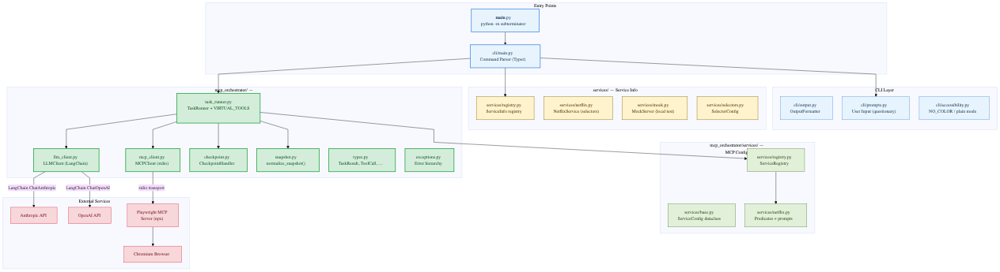
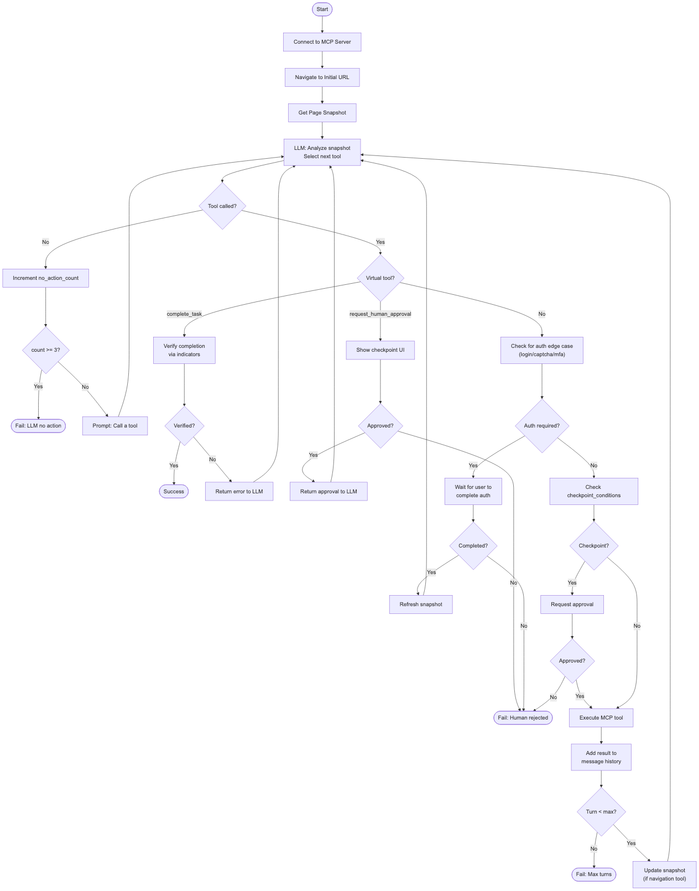
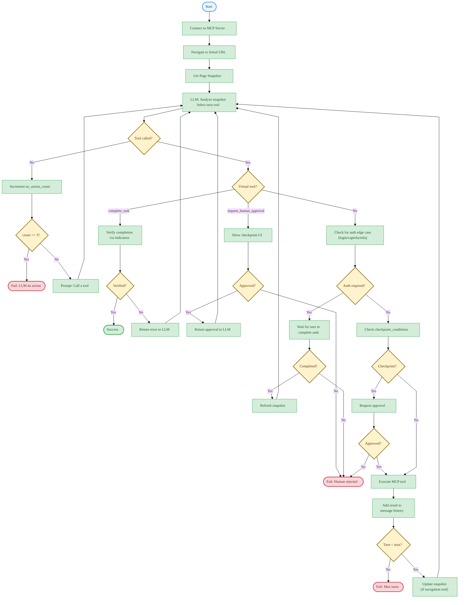
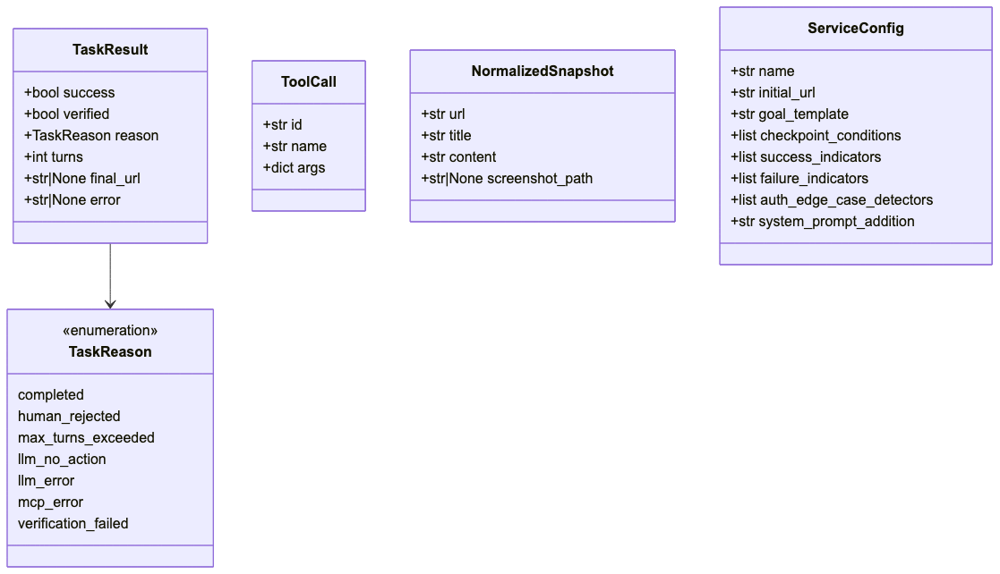
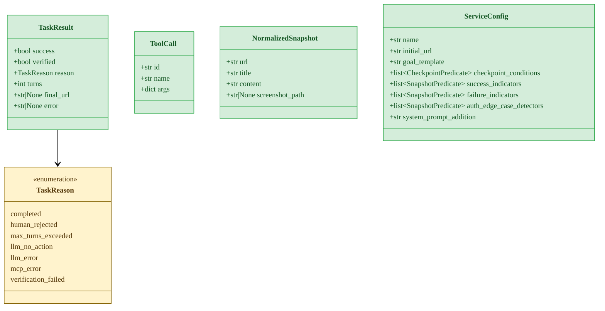
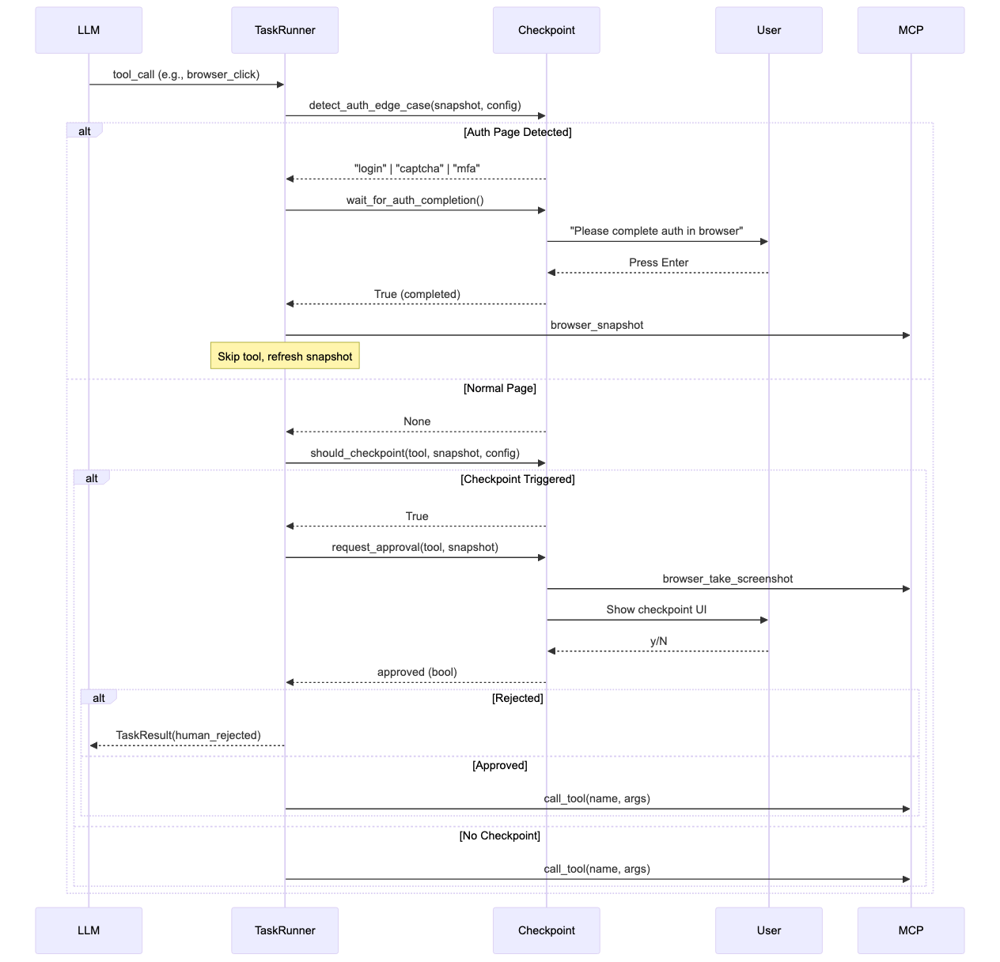
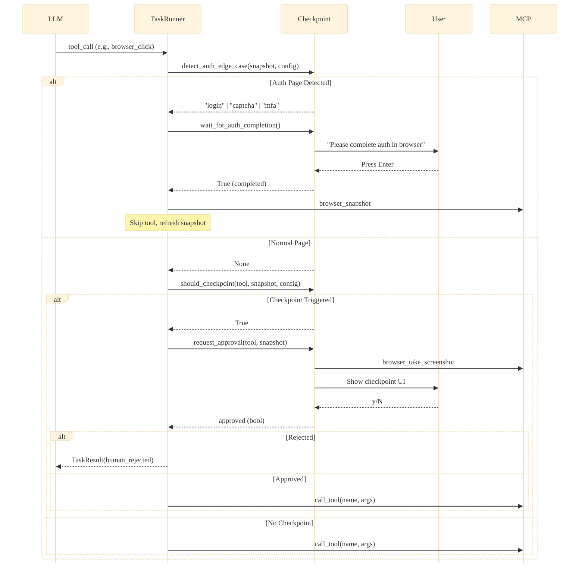
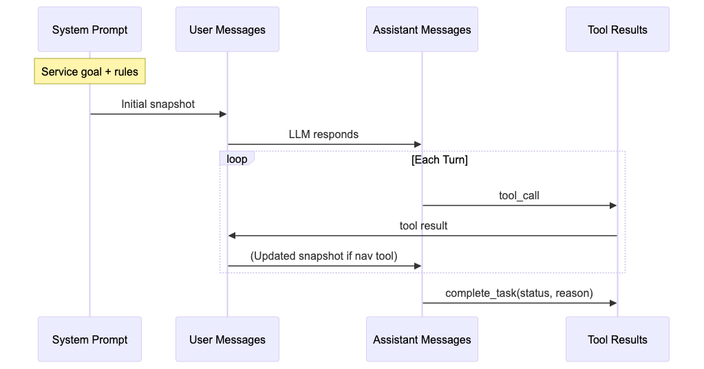
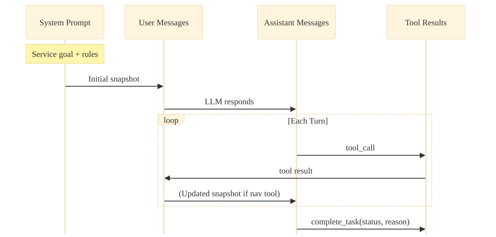

# SubTerminator Architecture

> **SubTerminator** is a CLI tool that uses AI-driven MCP (Model Context Protocol) orchestration to automate subscription cancellations via browser automation.
>
> **Tech stack:** Python 3.12 | Typer + Rich | LangChain (Anthropic/OpenAI) | Playwright MCP | Chromium

This document provides system design diagrams and component descriptions for the SubTerminator codebase.

---

## High-Level Architecture

```mermaid
%%{init: {'theme': 'base', 'themeVariables': {'fontFamily': 'Trebuchet MS, Verdana, Arial, Sans-Serif', 'fontSize': '14px'}, 'flowchart': {'curve': 'linear', 'nodeSpacing': 30, 'rankSpacing': 40}}}%%
flowchart TB
    subgraph Entry["Entry Points"]
        dunder["__main__.py<br/>python -m subterminator"]
        main["cli/main.py<br/>Command Parser (Typer)"]
    end

    subgraph CLI["CLI Layer"]
        output["cli/output.py<br/>OutputFormatter"]
        prompts["cli/prompts.py<br/>User Input (questionary)"]
        access["cli/accessibility.py<br/>NO_COLOR / plain mode"]
    end

    subgraph TopServices["services/ — Service Info"]
        sreg["services/registry.py<br/>ServiceInfo registry"]
        snetflix["services/netflix.py<br/>NetflixService (selectors)"]
        smock["services/mock.py<br/>MockServer (local test)"]
        sselect["services/selectors.py<br/>SelectorConfig"]
    end

    subgraph MCP["mcp_orchestrator/ — Orchestration Engine"]
        runner["task_runner.py<br/>TaskRunner + VIRTUAL_TOOLS"]
        llm["llm_client.py<br/>LLMClient (LangChain)"]
        mcpc["mcp_client.py<br/>MCPClient (stdio)"]
        checkpoint["checkpoint.py<br/>CheckpointHandler"]
        snapshot["snapshot.py<br/>normalize_snapshot()"]
        types["types.py<br/>TaskResult, ToolCall, …"]
        excepts["exceptions.py<br/>Error hierarchy"]
    end

    subgraph MCPServices["mcp_orchestrator/services/ — MCP Configs"]
        mbase["services/base.py<br/>ServiceConfig dataclass"]
        mreg["services/registry.py<br/>ServiceRegistry"]
        mnetflix["services/netflix.py<br/>Predicates + prompts"]
    end

    subgraph External["External Services"]
        anthropic["Anthropic API"]
        openai["OpenAI API"]
        mcpserver["Playwright MCP<br/>Server (npx)"]
        chromium["Chromium Browser"]
    end

    dunder --> main
    main --> prompts
    main --> sreg
    main --> runner

    runner --> llm
    runner --> mcpc
    runner --> checkpoint
    runner --> snapshot
    runner --> mreg
    mreg --> mnetflix

    llm -->|LangChain ChatAnthropic| anthropic
    llm -->|LangChain ChatOpenAI| openai
    mcpc -->|stdio transport| mcpserver
    mcpserver --> chromium

    classDef entry fill:#E8F4FD,stroke:#4A90E2,stroke-width:2px,color:#1a3a5c
    classDef cli fill:#E8F4FD,stroke:#4A90E2,stroke-width:1px,color:#1a3a5c
    classDef services fill:#FFF3CD,stroke:#856404,stroke-width:1px,color:#533608
    classDef mcp fill:#D4EDDA,stroke:#28a745,stroke-width:2px,color:#155724
    classDef mcpservices fill:#E2F0D9,stroke:#548235,stroke-width:1px,color:#2d4a1a
    classDef external fill:#F8D7DA,stroke:#dc3545,stroke-width:1px,color:#721c24

    class dunder,main entry
    class output,prompts,access cli
    class sreg,snetflix,smock,sselect services
    class runner,llm,mcpc,checkpoint,snapshot,types,excepts mcp
    class mbase,mreg,mnetflix mcpservices
    class anthropic,openai,mcpserver,chromium external
```



<details>
<summary>Mermaid source</summary>



</details>

---

## MCP Orchestrator Flow



<details>
<summary>Mermaid source</summary>



</details>

---

## Component Descriptions

### Entry Points

| Component | File | Responsibility |
|-----------|------|----------------|
| Module Entry | `subterminator/__main__.py` | Enables `python -m subterminator` invocation |
| CLI App | `subterminator/cli/main.py` | Typer app: `cancel` command, option parsing, orchestration bootstrap |

### CLI Layer (`subterminator/cli/`)

| Component | File | Responsibility |
|-----------|------|----------------|
| Command Parser | `cli/main.py` | Parse CLI arguments via Typer, create components, run orchestrator |
| Output Formatter | `cli/output.py` | Format progress messages, warning output |
| User Prompts | `cli/prompts.py` | Interactive service selection via questionary, TTY detection |
| Accessibility | `cli/accessibility.py` | NO_COLOR standard, plain mode, animation suppression |

### CLI Options (`subterminator cancel`)

| Flag | Short | Default | Description |
|------|-------|---------|-------------|
| `--dry-run` | `-n` | `False` | Run without making changes (stops at first action) |
| `--headless` | | `False` | Run browser in headless mode |
| `--verbose` | `-V` | `False` | Show detailed progress information |
| `--service` | `-s` | (interactive) | Service to cancel (bypasses interactive menu) |
| `--no-input` | | `False` | Disable all interactive prompts |
| `--plain` | | `False` | Disable colors and animations |
| `--profile-dir` | | auto-detect | Persistent browser profile directory |
| `--model` | | `claude-opus-4-6` | LLM model override |
| `--max-turns` | | `20` | Maximum orchestration turns |
| `--no-checkpoint` | | `False` | Disable human checkpoints |
| `--version` | `-v` | | Show version and exit |

### Exit Codes

| Code | Meaning |
|------|---------|
| `0` | Success — cancellation completed |
| `1` | Failure — cancellation failed |
| `2` | User cancelled (Ctrl+C or menu) / configuration error |
| `3` | Invalid or unavailable service |
| `5` | MCP connection error |
| `130` | SIGINT during orchestration |

---

### MCP Orchestrator (`subterminator/mcp_orchestrator/`)

| Component | File | Responsibility |
|-----------|------|----------------|
| TaskRunner | `mcp_orchestrator/task_runner.py` | Main orchestration loop, virtual tool dispatch, turn management, SIGINT handling |
| LLMClient | `mcp_orchestrator/llm_client.py` | LangChain-based LLM abstraction; auto-detects Anthropic (`claude-*`) or OpenAI (`gpt-*`) by model name prefix; default model: `claude-opus-4-6`; retries with exponential backoff (1s, 2s, 4s); 60s timeout |
| MCPClient | `mcp_orchestrator/mcp_client.py` | Playwright MCP server subprocess via stdio transport; validates Node.js >= 18; tool caching; auto-reconnect support |
| CheckpointHandler | `mcp_orchestrator/checkpoint.py` | Auth edge-case detection (login/captcha/mfa), checkpoint predicate evaluation, screenshot capture, approval UI |
| SnapshotParser | `mcp_orchestrator/snapshot.py` | Parse `browser_snapshot` markdown output into `NormalizedSnapshot` (url, title, content) |
| Types | `mcp_orchestrator/types.py` | `TaskResult`, `ToolCall`, `NormalizedSnapshot`, `TaskReason` literal, predicate type aliases |
| Exceptions | `mcp_orchestrator/exceptions.py` | `OrchestratorError` hierarchy: `MCPConnectionError`, `MCPToolError`, `LLMError`, `CheckpointRejectedError`, `SnapshotValidationError`, `ServiceNotFoundError` |

### MCP Service Configs (`subterminator/mcp_orchestrator/services/`)

These are predicate-based service configurations used by the orchestration engine. Each service defines checkpoint conditions, success/failure indicators, auth detectors, and system prompt additions.

| Component | File | Responsibility |
|-----------|------|----------------|
| ServiceConfig | `mcp_orchestrator/services/base.py` | Dataclass: `name`, `initial_url`, `goal_template`, predicate lists (`checkpoint_conditions`, `success_indicators`, `failure_indicators`, `auth_edge_case_detectors`), `system_prompt_addition` |
| ServiceRegistry | `mcp_orchestrator/services/registry.py` | Register/lookup `ServiceConfig` by name; `default_registry` global instance |
| Netflix (MCP) | `mcp_orchestrator/services/netflix.py` | Netflix predicates: `is_payment_page` checkpoint, 5 success indicators, 4 failure indicators, 3 auth detectors; LLM system prompt with termination rules |

### Services — Service Info (`subterminator/services/`)

Top-level service registry for CLI presentation (service listing, availability, fuzzy matching). Separate from MCP orchestrator service configs.

| Component | File | Responsibility |
|-----------|------|----------------|
| ServiceInfo Registry | `services/registry.py` | `ServiceInfo` dataclass (`id`, `name`, `description`, `available`); `SERVICE_REGISTRY` list; `get_available_services()`, `get_service_by_id()`, `suggest_service()` (fuzzy match) |
| Netflix (Info) | `services/netflix.py` | `NetflixService` class with CSS/ARIA selectors, text indicators, entry URLs (live + mock) |
| Mock Server | `services/mock.py` | `MockServer` — local HTTP server serving test Netflix HTML pages with variant routing |
| Selectors | `services/selectors.py` | `SelectorConfig` dataclass — CSS selector list with optional ARIA `(role, name)` fallback |

### Utilities (`subterminator/utils/`)

| Component | File | Responsibility |
|-----------|------|----------------|
| Config | `utils/config.py` | `AppConfig` dataclass, `ConfigLoader` — env var handling with dotenv |
| Exceptions | `utils/exceptions.py` | Root exception hierarchy: `SubTerminatorError` -> `TransientError` / `PermanentError` -> `ConfigurationError`, `ServiceError`, `HumanInterventionRequired`, etc. |
| Session Logger | `utils/session.py` | `SessionLogger` — JSON session log with state transitions, AI calls, screenshots |

---

## Data Types

### MCP Orchestrator Types



<details>
<summary>Mermaid source</summary>



</details>

---

## Checkpoint Flow



<details>
<summary>Mermaid source</summary>



</details>

---

## Tool Execution

### Available MCP Tools (from Playwright MCP)

| Tool | Description |
|------|-------------|
| `browser_navigate` | Navigate to URL |
| `browser_click` | Click element by ref |
| `browser_type` | Type into input field |
| `browser_snapshot` | Get page accessibility tree (markdown format) |
| `browser_take_screenshot` | Capture screenshot (base64 PNG) |

### Virtual Tools

Defined in `mcp_orchestrator/task_runner.py:VIRTUAL_TOOLS`. These are intercepted by `TaskRunner` and never reach the MCP server.

| Tool | Parameters | Description |
|------|-----------|-------------|
| `complete_task` | `status` (required): `"success"` or `"failed"`; `reason` (required): explanation | Signal task completion or failure. On `"success"`, triggers verification via success/failure indicator predicates. |
| `request_human_approval` | `action` (required): description of action; `reason` (required): why approval is needed | Request explicit human approval before proceeding. Used for irreversible actions or when the LLM is unsure. |

---

## Message Flow



<details>
<summary>Mermaid source</summary>



</details>

The message history accumulates:
1. System prompt with goal + service-specific instructions
2. User message with page snapshot
3. Assistant tool_call
4. Tool result
5. (If `browser_navigate`/`browser_click`/`browser_type`) User message with updated snapshot
6. Repeat until `complete_task`

---

## Image Regeneration

The PNG images in `docs/images/` can be regenerated from the Mermaid source blocks in this document using `mermaid-cli` or the `mcp__mermaid__generate_mermaid_diagram` MCP tool:

```bash
# If mmdc is installed
mmdc -i architecture.md -o images/architecture-high-level.png -w 800
```

Target files:
- `images/architecture-high-level.png`
- `images/mcp-orchestrator-flow.png`
- `images/data-types.png`
- `images/checkpoint-flow.png`
- `images/message-flow.png`
